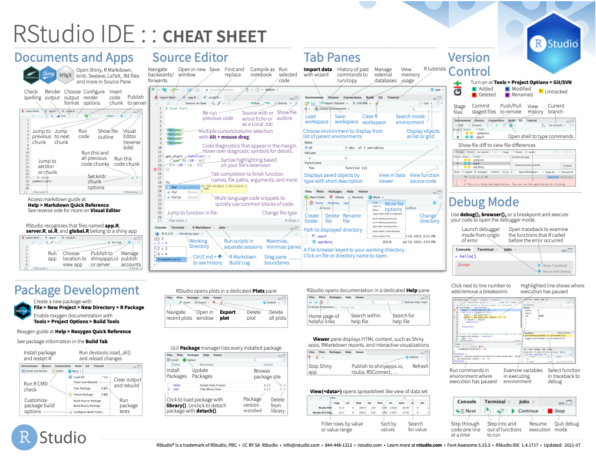
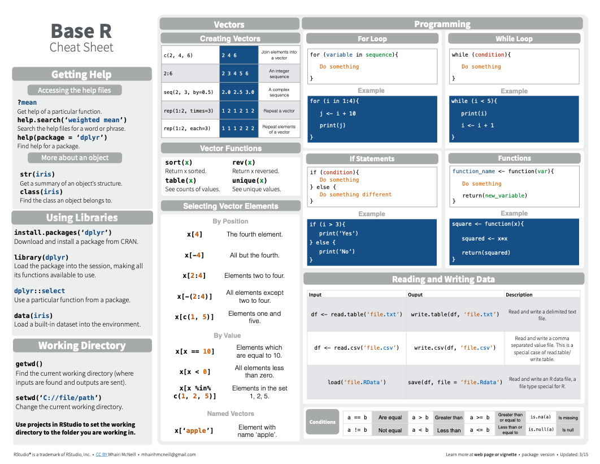
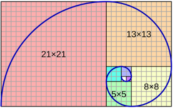
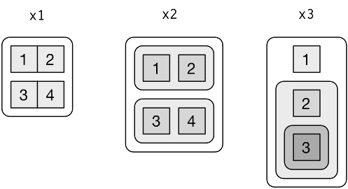
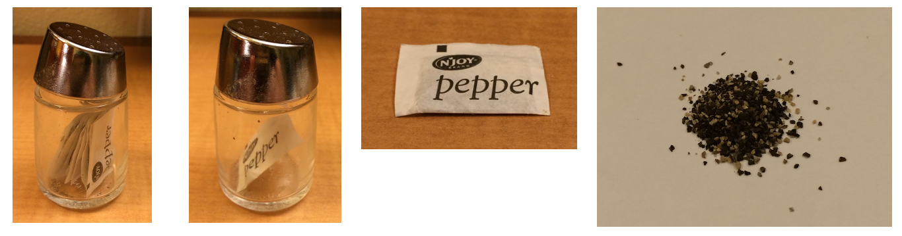
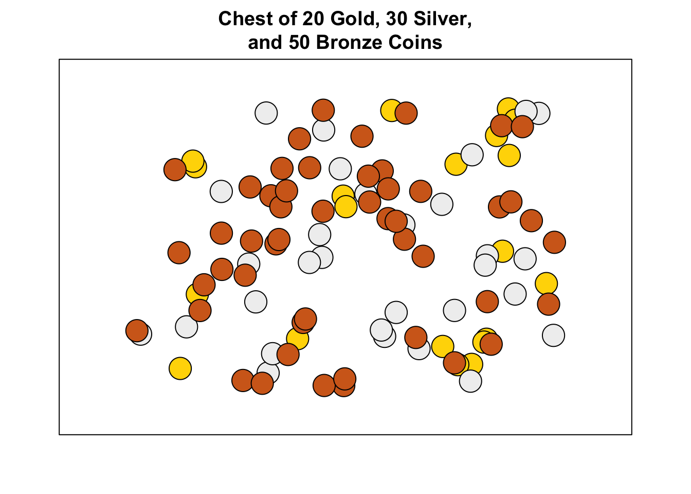
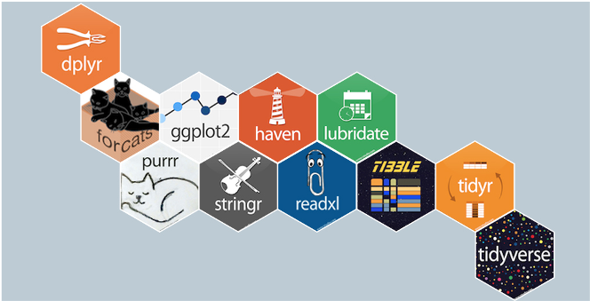
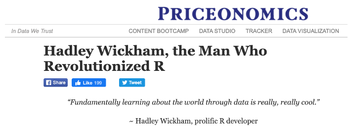
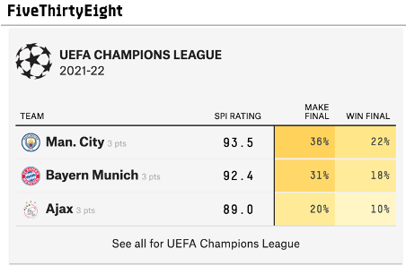

# Organizational aspects

## Class policies

* Programming 0 __will be graded__, but this grade will not be part of the official academic records

* There will be __homework__ in both P0 and PI; attendance will be graded only in P0; there will midterm and final only in PI

* Grade weights for P0 will be approximately 20% attendance - 60% homework - 20% class participation

* Grade weights for PI will be approximately 10% attendance - 30% homework - 30% midterm - 30% final

What follows apply both for P0 and PI:

* For the homework, it is mandatory that you __form groups of 3 or 4 people__

* You need to sign up into a group via Blackboard

* You need to submit the code via Blackboard, i.e. you need to copy-paste the .R file; do *not* submit the .Rproj, *nor* lines copied from the terminal with ">>>", else your grade will be null

* Only one person per group will submit the homework, and the names of the people in the group will be indicated at the top of the assignment

* If you cannot find __teammates__ for for a group, you can ask me to assign you to a group randomly

* The deadline for each homework will always be right before the beginning of the next class (e.g. if topic X is covered on Wed nth, then the homework for topic X is due right before the class on Wed n+7th)

## Sessions and exams

| Subject | Session # | Type | Date |
|-----------|-----------|------------|---------------------|
| P0 | S1 + S2 | Lecture | Jan 11th 2022 |
| P0 | S3 + S4 | Lecture | Jan 18th 2022 |
| P0 | S5 + S6 | Lecture | Jan 25st 2022 |
| P0 | S7 + S8 | Lecture | Feb 8th 2022 |
| P0 | S9 + S10 | Lecture | Feb 22th 2022 |
| PI | S1 + S2 | Lecture | Mar 1st 2022 |
| PI | S3 + S4 | Lecture | Mar 15th 2022 |
| PI | S5 + S6 | Lecture | Mar 22nd 2022 |
| PI | S7 + S8 | **Midterm** | Apr 12th 2022 |
| PI | S9 + S10 | Lecture | Apr 19th 2022 |
| PI | S11 + S12 | Lecture | May 3rd 2022 |
| PI | S13 + S14 | Lecture | May 10th 2022 |
| PI | S15 | **Final** | May 24th 2022 |

## Bibliography

* Hadley Wickham. R for Data Science. O'Reilly
* Joseph Adler. R in a Nutshell. O'Reilly

The following notes borrow heavily from Wickham's excellent book.

# Introduction to programming

## Definition of a programming language

A __program is a set of instructions given to a computer__ in order to perform a set of instructions in order. The computer runs this instructions __in a deterministic way__, i.e. it does not make decisions nor introduce randomness in the process. In order to write a program one needs __a programming language__, the same way that in order to write a letter to another person one needs a (human) language, with the difference that the relationship with the computer is asymmetrical.

__The closer a language is to the computer, the more “low-level” it is said to be__ — conversely, the closer the language is to human abstraction, the more “high-level” it is said to be. Unless you go deep into Computer Science, most of the time you will deal with high-level languages

{width=30%}

## Overview of programming languages

__Different programming languages__ have different approaches and characteristics — some are more powerful than others, and some are better suited to certain types of problems. Because of the commitment of time that learning a language presents, programmers tend to defend their favorite language at the expense of the rest and become opinionated.

__Some classic, powerful languages__ are Lisp, Fortran, C, C++, Python, Perl… they will probably be around for the decades to come. Other more recent ones are Java, Ruby, Go, Julia...

__R is good for analysis but not the most elegant or powerful language__; however, it is strong in statistics and has seen a rebirth in the last decade thanks to the advent of Big Data and Machine Learning.


## Development environments

In order to write a programming language __you just need a text editor and a compiler or an interpreter__ depending on whether the language is compiled or not. Often these two elements are combined into what is known as an __IDE (Integrated Development Environment)__ for the sake of convenience. 

Some good text editors are _Atom_ or _Sublime text_, and some well-known IDEs are _VSCode_, _Pycharm_, and _Eclipse_.

In the case of R, _RStudio_ is the most popular IDE. __I recommend that you install both R and RStudio__ in your mac or PC; however, in case you do not want to install anything you may also use _RStudio Cloud_ — all these resources are free. _Replit_ is another excellent web-based IDE, although it still has limited support for R


## Basic commands and operators in R

Let's get started: __open RStudio__ (either the web or the desktop version). As we saw in the intro, RStudio is at its core just a __text editor plus a console__ that interprets commands. Go to the console and type the example with the __print command__ on the command prompt (the “>” simbol) – you should get an output: this is the computer doing what you told him to do.


```r
print('Hello world')
```

```
[1] "Hello world"
```

You can store values in variables with the __assignment operator__ “<-”, think of this as putting the value (a number, a word, etc.) into a box to move it around more easily. You can know what is inside this “box” by printing the variable or by __just putting the variable name into the console__

```r
a<-10
a
```

```
[1] 10
```

```r
print(a)
```

```
[1] 10
```


```r
b=a**2
a+b
```

```
[1] 110
```

```r
animal <- 'dog'
animal
```

```
[1] "dog"
```

__The editor__, which typically appears in the upper left pane of RStudio, allows us to store commands and run them in order. You can "throw" a command from the editor to the console by typing _Ctrl Enter_ or _Command Enter_, or by clicking on the "Run" button in RStudio.

The __colon operator__ ”:” generates a sequence from one number of the next, and the ”c” function __concatenates__ values to create vectors — they are equivalent in this case but c is more general since it does not only handle sequences.


```r
1:5
```

```
[1] 1 2 3 4 5
```

```r
1:5 + 6:10
```

```
[1]  7  9 11 13 15
```

```r
c(1:5) + c(6:10)
```

```
[1]  7  9 11 13 15
```

```r
c(1,2)
```

```
[1] 1 2
```

```r
animals <- c('dog', 'sheep', 'pig')
animals
```

```
[1] "dog"   "sheep" "pig"  
```
The colon operator also works backwards:

```r
10:5
```

```
[1] 10  9  8  7  6  5
```
The importance of the __concatenate operator__ is idiosyncratic of R — other languages would have used loops in order to concatenate elements into a vector.

R is rich in __statistical functions__ such as sum, median, mean, etc. and in common mathematical operators such as “+”, “-”, “*”, “/”, “>”, “=”, “%%” etc.


```r
sum(1:5)
```

```
[1] 15
```

```r
median(1:10)
```

```
[1] 5.5
```

__Common mathematical and logical operators__ are quite intuitive except for “==”, which evaluates whether two elements are equal, and which should not be confused with “=”, which assigns a value to an element the same way as "<-" does. To prevent confusion, it is better to avoid using “=” at all in R.


```r
3>4
```

```
[1] FALSE
```

```r
3==4
```

```
[1] FALSE
```

If you do not remember how an operator works, you may just type its name preceded by “?”, and the help window will provide you with the documentation.

```r
?":"
?mean
```
Common operators such as division,  multiplication, or classic mathematical functions can also be “vectorized”, but in general it is safer to do so with the “c” operator than with the “:”.


```r
10/3
```

```
[1] 3.333333
```

```r
1:3/3
```

```
[1] 0.3333333 0.6666667 1.0000000
```

```r
cos(c(pi,2*pi))
```

```
[1] -1  1
```

```r
exp(c(1:3))
```

```
[1]  2.718282  7.389056 20.085537
```

Logical operators also work with the vectorized format.

```r
1:4 > c(2,2,2,2)
```

```
[1] FALSE FALSE  TRUE  TRUE
```

__EXERCISE__

Let's practice a bit:

(1) Calculate the sum of the integers from 1 to 100.

```r
sum(1:100)
```

```
[1] 5050
```

(2) Calculate the sum of the remainder of the division of all integers from 1 to 100 by 3.

```r
10%%3 #get familiar with the modulo operator
```

```
[1] 1
```

```r
1:100%%3
```

```
  [1] 1 2 0 1 2 0 1 2 0 1 2 0 1 2 0 1 2 0 1 2 0 1 2 0 1 2 0 1 2 0 1 2 0 1 2 0 1
 [38] 2 0 1 2 0 1 2 0 1 2 0 1 2 0 1 2 0 1 2 0 1 2 0 1 2 0 1 2 0 1 2 0 1 2 0 1 2
 [75] 0 1 2 0 1 2 0 1 2 0 1 2 0 1 2 0 1 2 0 1 2 0 1 2 0 1
```

```r
sum(1:100%%3)
```

```
[1] 100
```

(3) Will `sqrt(2)**2-2` yield zero in R? Why or why not?

```r
sqrt(2)**2 - 2 == 0
```

```
[1] FALSE
```

```r
all.equal(sqrt(2)**2, 2)
```

```
[1] TRUE
```


## Quick recap of what we have covered until now

* We saw what a __programming language__ is, some different types of languages and why we are using R

* We got started with __R’s basic commands__, including assignments (‘<-’), prints, and mathematical operators

* We got familiar with __R Studio__ (either the desktop or the cloud version) and its basic features, namely the text editor and the console

* We saw how to __generate sequences__ with the “:” operator and vectors with the “concatenate” operator, and how to calculate basic statistics from them

* We explored the __”help” command__ (“?”), the __logical evaluator__ “==“ and how to apply them in a vectorized way

* We solved our first __quizzes__ by applying the aforementioned tools

* If you have __questions from last class__, now it is a good time to cover them before moving forward

Let's start by reviewing sequences and vector indexing:

```r
(1:10)
```

```
 [1]  1  2  3  4  5  6  7  8  9 10
```

```r
(1:10)+0.5
```

```
 [1]  1.5  2.5  3.5  4.5  5.5  6.5  7.5  8.5  9.5 10.5
```

```r
v <- c('ie university', 'harvard', 'london school of economics')
v
```

```
[1] "ie university"              "harvard"                   
[3] "london school of economics"
```

```r
v[-1]
```

```
[1] "harvard"                    "london school of economics"
```

```r
v[c(2,3)]
```

```
[1] "harvard"                    "london school of economics"
```

```r
v[-3]
```

```
[1] "ie university" "harvard"      
```

```r
v[c(-2,-3)]
```

```
[1] "ie university"
```

```r
v[c(-2,-3)]
```

```
[1] "ie university"
```

## Getting to know your IDE (Integrated Development Environment)

Programming is not about rote memory, so feel free to use cheat sheets liberally — check the ones here:
[Cheat sheets](https://www.rstudio.com/resources/cheatsheets)

Some quick tips:

* Use Ctrl+1 and Ctrl+2 to switch between the editor and the console

* Use Alt+“-” to impute a “<-”

* Use Ctrl+Shift+Up in the console to reuse commands that start with a certain character

* Use just the Up arrow to reuse the last commands

* Use Ctrl+Enter or Cmd+Enter to run the code in the editor (you can run just a chunk of code if you first highlight it)



## Remembering R commands

* Programming languages share many concepts but use __different syntax__ to communicate with the computer

* Compared to Python, which you will learn in Programming II, __R syntax is not too distant__, and this can make it easier to learn one after the other but confusing when switching between languages (similarly to jumping between Spanish and Portuguese versus switching between Spanish and German)

* When in doubt, feel free to use cheat sheets and the official documentation to look up syntax: 
[R Official Documentation](https://www.r-project.org/other-docs.html)

* Remember also that the ? command is quite helpful to be used directly in the console




 
## Types of variables

* Variables can be real numbers (“numeric”), interger numbers (“integer”), strings of text (“character”), true/false statements (“logical”), etc. — __in R, these categories are called “classes”__ (beware that the word has a different meaning in other programming languages)

* __The difference between numeric and integer can be blurry__ sometimes, but typically R will handle it in a way that you do not need to explicitly care about it

* __A factor is a specific type of variable that R uses to handle categorical data__ — categorical data is data defined in discreet pieces as opposed to data defined along a continuum: e.g. the height of a person is continuous, but the nationality or the mother tongue are categorical

* You can think of __factors as a hybrid between integers and characters__ consisting of different “levels” or categories


```r
class(1:2)
```

```
[1] "integer"
```

```r
class(1)
```

```
[1] "numeric"
```

```r
class(2==2)
```

```
[1] "logical"
```

```r
class(1i)
```

```
[1] "complex"
```

```r
grades <- c('A+', 'A-', 'B+', 'B-', 'A+', 'B+', 'A+')
factor(grades)
```

```
[1] A+ A- B+ B- A+ B+ A+
Levels: A- A+ B- B+
```

# Loops
## Introducing loops

* Loops are the way to ask the computer to __perform iterative operations__

* They consist of three parts: a __sequence__, which comes after the “in” clause; a __body__, which are the commands between the brackets; and an __output__, which needs to exist only if we want to store the results

* Loops require a __variable to “iterate”__ through several elements and do some actions

* Loops avoid copy-pasting code and are a __powerful tool of most programming languages__; however, in R we will find that vectors can often replace loops


```r
for (animal in c('chicken', 'pig')){
  print(animal)
}
```

```
[1] "chicken"
[1] "pig"
```

```r
for (i in grades){
  print(i)
}
```

```
[1] "A+"
[1] "A-"
[1] "B+"
[1] "B-"
[1] "A+"
[1] "B+"
[1] "A+"
```

## Practicing loops

* Use the expression below to calculate the first 6 values of Ulam spiral

$$ 4 \cdot n^2 + 3 \cdot n +1 $$

```r
for (n in (1:6)){
  print(4*n**2+3*n+1)
}
```

```
[1] 8
[1] 23
[1] 46
[1] 77
[1] 116
[1] 163
```

```r
4*(0:5)**2+3*(0:5)+1
```

```
[1]   1   8  23  46  77 116
```

# Vectors


## Introducing vectors

R is powerful and concise in handling __vectors, matrices and arrays__, so we will review this algebraic elements and it’s properties.

Remember that vectors can be created both the with __colon operator and the concatenate operator__.

The vector function creates an empty vector of a specified type and length — in computer science this process is called __“allocation”__, and is particularly important in low-level languages.


```r
8:4
```

```
[1] 8 7 6 5 4
```

```r
c(8:5, 4)
```

```
[1] 8 7 6 5 4
```

```r
vector('numeric', 5)
```

```
[1] 0 0 0 0 0
```

```r
vector('complex', 5)
```

```
[1] 0+0i 0+0i 0+0i 0+0i 0+0i
```

```r
vector('logical', 5)
```

```
[1] FALSE FALSE FALSE FALSE FALSE
```

The __seq operator__ is an extension of the colon operator that allows for creation of lists more generally.

The __length operator__ measures the number of elements in a vector.


```r
seq(from=1, to=20, by=4.5)
```

```
[1]  1.0  5.5 10.0 14.5 19.0
```

```r
a <- seq(from=1, to=20.5, by=4.5)
length(a)
```

```
[1] 5
```

{width=30%}

Calculate how many intervals of three units are there between $2^{10}$ and $2^{11}$.


```r
length(seq(from=2**10, to=2**11, by=3))
```

```
[1] 342
```

## Exploring properties of vectors

In R, each element of a vector can be given a name — __the name of a vector__ can be modified.


```r
prices <- c(apple=1.5, banana=2.0, orange=3.5, 1.8)
prices
```

```
 apple banana orange        
   1.5    2.0    3.5    1.8 
```

```r
names(prices) <- c('apple', 'banana', 'orange', 'pear')
prices
```

```
 apple banana orange   pear 
   1.5    2.0    3.5    1.8 
```


__R has several ways of “indexing”__ (also known as subsetting or slicing), which means accessing only part of a vector.


```r
prices[1]
```

```
apple 
  1.5 
```

```r
prices["apple"]
```

```
apple 
  1.5 
```

If you want to __retrieve a slice__ with several elements, the indexes themselves have to be a vector.


```r
prices[c(1,2)]
```

```
 apple banana 
   1.5    2.0 
```

The __which function__ returns the locations where a logical vector is TRUE. __which.min(x) and which.max(x)__ are shortcuts for which(min(x)) and which(max(x))


```r
prices
```

```
 apple banana orange   pear 
   1.5    2.0    3.5    1.8 
```

```r
which(prices <2)
```

```
apple  pear 
    1     4 
```

```r
which.max(prices)
```

```
orange 
     3 
```

If you try to __add vectors of different length__, the elements in the shorter vector will be recycled to match the longer one — this is bad practice.

```r
1:5 + 1:10
```

```
 [1]  2  4  6  8 10  7  9 11 13 15
```

If we really want to create a vector with repeated elements, we can explicitly do so with the __rep() function__.

```r
rep(1:5, 2, each = 2)
```

```
 [1] 1 1 2 2 3 3 4 4 5 5 1 1 2 2 3 3 4 4 5 5
```

```r
rep(1:5, 2, length.out = 8)
```

```
[1] 1 2 3 4 5 1 2 3
```

## Allocating a vector to store output of a loop

We can use an __empty vector__ to store the results of a loop. This is more efficient computationally than enlarging a vector on each iteration of the loop.

In this first example we will calculate the __first eleven Fibonacci numbers__.

```r
storage <- vector('numeric', 10)
storage[1] <- 0
storage[2] <- 1
for (i in (2:10)){
  storage[i+1] <- storage[i] + storage[i-1]
}
storage
```

```
 [1]  0  1  1  2  3  5  8 13 21 34 55
```



Now, with the command “runif”, __generate one hundred numbers randomly distributed from 0 to 1__, and progressively add them up, storing the intermediate results in a vector.

Raise your hand if you want to volunteer!

{width=30%}


```r
generator <- runif(100)
output <- vector('numeric', length(generator))
for (i in (2:length(generator))){
  output[i] <- output[i-1] + generator[i]
}
output
```

```
  [1]  0.0000000  0.1462691  0.4768033  0.9936589  1.5973974  2.5010734
  [7]  2.9657812  3.1468063  3.2838152  3.4037868  3.6928498  4.2788006
 [13]  5.0599825  5.2033381  5.4135050  5.5210049  6.0609124  6.3718930
 [19]  6.5926674  7.3687455  8.2153140  8.9613009  9.2190295  9.5243790
 [25] 10.1758539 10.6668353 11.0870826 11.9882721 12.7169969 13.4425967
 [31] 13.7968970 13.9724228 14.1650641 14.7525242 14.9466768 15.7871569
 [37] 15.8220420 15.8639711 16.4505686 16.5988841 17.5133752 18.1535582
 [43] 18.2580631 18.7797681 18.9462437 19.7402178 20.1592672 20.7016662
 [49] 21.3590691 21.4247886 21.8512010 22.1021673 22.8862376 23.0799246
 [55] 23.4692531 24.1663754 24.8326777 25.7751823 25.8107712 26.7401439
 [61] 26.7761000 27.5779750 27.8143232 28.1208939 28.8802429 29.0904771
 [67] 29.3317397 29.9133018 30.8319127 30.9206853 31.4117213 32.3965663
 [73] 32.9979144 33.3628215 33.9936446 34.0834905 35.0137512 35.5031265
 [79] 36.0226413 36.8886721 37.3558394 37.6791869 37.8378757 37.8627562
 [85] 38.3728677 39.1622338 39.5753290 40.1171515 40.2520209 40.6477894
 [91] 41.2736569 41.3089168 41.4095710 41.9080513 42.1409619 42.3496461
 [97] 42.5509311 42.9928313 43.3159738 44.0580984
```

## Practicing vectors with some real data

(The files have been uploaded to Blackboard, but I still recommend that you go through the process of downloading them in order to get familiar with the resources).

Go to https://www.stlouisfed.org/ and click on __FRED Economic Data__.

{width=60%}

Type “Spain gdp” and click on the first search results.

{width=60%}

{width=60%}

Download the __time series in csv format__ and store it whenever you with in your computer.

If you are working with RStudio desktop, use the three dots at the right of the File pane to navigate to where the file is. If you are using RStudio Cloud, you need to use the “Upload” feature.

{width=60%}

{width=60%}

Click on the file and select “Import dataset”: __RStudio will open an import wizard__ that generates the code for you, although the important part is just the “read_csv” command.


```r
library(readr)
gdp <- read_csv("FRED/FRED_Spain_GDP.csv")
```

```
Rows: 106 Columns: 2
-- Column specification --------------------------------------------------------
Delimiter: ","
dbl  (1): CLVMNACSCAB1GQES
date (1): DATE

i Use `spec()` to retrieve the full column specification for this data.
i Specify the column types or set `show_col_types = FALSE` to quiet this message.
```

```r
gdp
```

```
# A tibble: 106 x 2
   DATE       CLVMNACSCAB1GQES
   <date>                <dbl>
 1 1995-01-01          176474.
 2 1995-04-01          177568.
 3 1995-07-01          178285.
 4 1995-10-01          179640.
 5 1996-01-01          180702.
 6 1996-04-01          182036.
 7 1996-07-01          183596.
 8 1996-10-01          184575.
 9 1997-01-01          186450.
10 1997-04-01          188141.
# ... with 96 more rows
```

{width=30%}
 
We have just loaded the content of the csv file into a __dataframe or tibble__ (which is a slightly improved version of a dataframe).

```r
gdp 
```

```
# A tibble: 106 x 2
   DATE       CLVMNACSCAB1GQES
   <date>                <dbl>
 1 1995-01-01          176474.
 2 1995-04-01          177568.
 3 1995-07-01          178285.
 4 1995-10-01          179640.
 5 1996-01-01          180702.
 6 1996-04-01          182036.
 7 1996-07-01          183596.
 8 1996-10-01          184575.
 9 1997-01-01          186450.
10 1997-04-01          188141.
# ... with 96 more rows
```

We can access the columns of the dataframe with the __$ operator__ — e.g. we can push the content of the column with the GDP values into a vector. __Dataframes are actually more powerful__ to deal with tabular data, but let’s stick with vectors for the moment.


```r
gdp_values <- gdp$CLVMNACSCAB1GQES
gdp_dates <- gdp$DATE
```

Calculate the __maximum value__ of Spain’s quarterly GDP, and the quarter when it happened.

```r
gdp_dates[which.max(gdp_values)]
```

```
[1] "2019-10-01"
```

Calculate the __quarters__ where Spain’s GDP was lower than €200 Bn.

```r
gdp_dates[which(gdp_values<200000)]
```

```
 [1] "1995-01-01" "1995-04-01" "1995-07-01" "1995-10-01" "1996-01-01"
 [6] "1996-04-01" "1996-07-01" "1996-10-01" "1997-01-01" "1997-04-01"
[11] "1997-07-01" "1997-10-01" "1998-01-01" "1998-04-01" "1998-07-01"
```

Generate a vector with __all the values except for the last one__ in the series.

```r
gdp_values[-length(gdp_values)]
```

```
  [1] 176473.9 177568.5 178285.3 179640.3 180702.1 182036.3 183596.2 184575.4
  [9] 186449.5 188140.6 190378.5 193004.1 194695.2 196891.3 198751.4 200934.7
 [17] 202940.9 205347.8 208077.8 210438.0 213804.3 216481.6 218818.0 221072.8
 [25] 223420.0 225071.4 227169.1 228740.9 229714.2 231586.2 233013.9 234786.5
 [33] 236971.7 238206.5 239777.3 241850.1 243308.6 245685.7 247996.1 249693.2
 [41] 252130.9 254354.9 256814.5 259418.3 262388.9 264932.0 267393.6 269964.5
 [49] 272434.1 274875.8 276983.4 278764.0 279365.5 279670.7 279155.7 274650.1
 [57] 267494.0 267465.2 268029.9 267975.2 267899.6 268301.3 268164.1 268344.0
 [65] 267925.5 267076.4 265345.6 263624.7 261154.1 258643.8 257325.5 255363.0
 [73] 254546.8 254324.1 254184.9 254608.4 255544.0 256728.0 258627.9 260847.9
 [81] 263841.4 266671.8 269098.6 271706.3 273547.6 274694.8 277131.6 278419.0
 [89] 280629.1 283642.5 285279.9 287064.4 288642.2 290144.4 291916.0 293533.6
 [97] 295066.6 296182.1 297229.9 298462.7 282441.5 232204.6 271801.8 271839.6
[105] 270655.5
```

Store the __dates as names__ of the vector with the values.

```r
names(gdp_values) <- gdp_dates
```

__Access the value__ of 2019Q4 by using its name.

```r
gdp_values['2020-01-01']
```

```
2020-01-01 
  282441.5 
```

# Matrices

## Introducing matrices

An array is the name for the generalized concept of vector in more than one dimensions. In the bidimensional case, arrays are typically called matrices — in R, a matrix is a special case of a bidimensional array.
$$A=\begin{pmatrix}
1 & 5 & 9 \\
2 & 6 & 10 \\
3 & 7 & 11 \\
4 & 8 & 12
\end{pmatrix}
$$

```r
matrix(1:12, nrow = 4)
```

```
     [,1] [,2] [,3]
[1,]    1    5    9
[2,]    2    6   10
[3,]    3    7   11
[4,]    4    8   12
```

```r
array(1:12, dim=c(2,2,3))
```

```
, , 1

     [,1] [,2]
[1,]    1    3
[2,]    2    4

, , 2

     [,1] [,2]
[1,]    5    7
[2,]    6    8

, , 3

     [,1] [,2]
[1,]    9   11
[2,]   10   12
```

Arrays and matrices are defined with the array and matrix functions, which bear some differences. You may use the array function to create a matrix as long as you specify two dimensions — you can check they are equivalent with the command “identical”.


```r
identical(array(1:12, dim=c(4,3)), matrix(1:12, nrow = 4))
```

```
[1] TRUE
```

The commands dim, ncol and nrow provide the size of the matrix or array.


```r
A <- matrix(1:12, nrow = 4)
dim(A)
```

```
[1] 4 3
```

```r
nrow(A)
```

```
[1] 4
```

```r
ncol(A)
```

```
[1] 3
```

```r
dim(A) <- c(2,6)
A
```

```
     [,1] [,2] [,3] [,4] [,5] [,6]
[1,]    1    3    5    7    9   11
[2,]    2    4    6    8   10   12
```
$$A=\begin{pmatrix}
1 & 3 & 5 & 7 & 9 & 11 \\
2 & 4 & 6 & 8 & 10 & 12 \\
\end{pmatrix}$$

_dim_ can be used to modify the dimensions.

## A few simple matrices

With the commands _eye_, _diag_, _ones_ and _zeros_ we can easily generate diagonal matrices, matrices full of ones and matrices full of zeros, respectively. Note that _eye_ is a generalization of _diag_ that does not require the matrix to be squared:

$$I=\begin{pmatrix}
1 & 0 & 0 \\
0 & 1 & 0 \\
0 & 0 & 1 \\
\end{pmatrix}
$$

```r
diag(3)
```

```
     [,1] [,2] [,3]
[1,]    1    0    0
[2,]    0    1    0
[3,]    0    0    1
```
$$ I_{not squared} = \begin{pmatrix}
1 & 0 & 0 & 0 \\
0 & 1 & 0 & 0 \\
0 & 0 & 1 & 0 \\
\end{pmatrix}
$$

```r
library('pracma')
eye(n=3, m=4)
```

```
     [,1] [,2] [,3] [,4]
[1,]    1    0    0    0
[2,]    0    1    0    0
[3,]    0    0    1    0
```

$$ \bf{1} = \begin{pmatrix}
1 & 1 \\
1 & 1 \\
\end{pmatrix}
$$

```r
ones(n=2, m=2)
```

```
     [,1] [,2]
[1,]    1    1
[2,]    1    1
```
$$ \bf{1} = \begin{pmatrix}
1 & 1 & 1 \\
1 & 1 & 1 \\
\end{pmatrix}
$$

```r
ones(n=2, m=3)
```

```
     [,1] [,2] [,3]
[1,]    1    1    1
[2,]    1    1    1
```

## Indexing matrices
In R, the columns and rows of a matrix or array can be given names, similarly to the elements of a vector — we will focus on matrices for the sake of simplicity. Names need to be provided in a list of two vectors — “lists” are just collections of elements (in this case, vectors) that we will study later on.

$$B=\begin{pmatrix}
1 & 4 & 7 & 10 \\
2 & 5 & 8 & 11 \\
3 & 6 & 9 & 12 \\
\end{pmatrix}$$


```r
B <- matrix(1:12, nrow=3, dimnames=list(c('R1', 'R2', 'R3'),
                                        c('C1', 'C2', 'C3', 'C4')))
B
```

```
   C1 C2 C3 C4
R1  1  4  7 10
R2  2  5  8 11
R3  3  6  9 12
```

Indexing can be done through the actual “indexes” or through the names of the rows and columns — as you see, it is easy to get creative and generate “slices” of the matrix.


```r
rownames(B)
```

```
[1] "R1" "R2" "R3"
```

```r
colnames(B)
```

```
[1] "C1" "C2" "C3" "C4"
```

```r
B[1,3]
```

```
[1] 7
```

```r
B['R3', 'C2']
```

```
[1] 6
```

```r
B[1:2, c('C2', 'C3')]
```

```
   C2 C3
R1  4  7
R2  5  8
```


Matrix can be spread out and converted to vectors, and also be bound with another matrices — these are not algebraic operations but still will be useful.

$$B=\begin{pmatrix}
1 & 4 & 7 & 10 \dotsc 11 & 12 \\
\end{pmatrix}$$


```r
c(B)
```

```
 [1]  1  2  3  4  5  6  7  8  9 10 11 12
```

Matrices can also be bound together, even when they hold different types of variables.


```r
C = matrix(rep(c('chicken', 'pig', 'cow'), 4),
           nrow = 3,
           dimnames = list(c('R1', 'R2', 'R3'), c('C1', 'C2', 'C3', 'C4')))
rbind(B,C)
```

```
   C1        C2        C3        C4       
R1 "1"       "4"       "7"       "10"     
R2 "2"       "5"       "8"       "11"     
R3 "3"       "6"       "9"       "12"     
R1 "chicken" "chicken" "chicken" "chicken"
R2 "pig"     "pig"     "pig"     "pig"    
R3 "cow"     "cow"     "cow"     "cow"    
```

```r
cbind(B,C)
```

```
   C1  C2  C3  C4   C1        C2        C3        C4       
R1 "1" "4" "7" "10" "chicken" "chicken" "chicken" "chicken"
R2 "2" "5" "8" "11" "pig"     "pig"     "pig"     "pig"    
R3 "3" "6" "9" "12" "cow"     "cow"     "cow"     "cow"    
```

## Performing arithmetic with arrays

The standard arithmetic operators work element-wise on matrices, given they are the appropriate size.

```r
B
```

```
   C1 C2 C3 C4
R1  1  4  7 10
R2  2  5  8 11
R3  3  6  9 12
```

```r
B**2
```

```
   C1 C2 C3  C4
R1  1 16 49 100
R2  4 25 64 121
R3  9 36 81 144
```

```r
B*(B**2)
```

```
   C1  C2  C3   C4
R1  1  64 343 1000
R2  8 125 512 1331
R3 27 216 729 1728
```
Again, note that these operations are element-wise and therefore are not the same as the algebraic operations $$ B \cdot B $$ or $$B \cdot B^2 $$ respectively.

So, let's get started with actual algebraic operations. The simplest one is the transpose operator, which is named _t_ in R.
$$ B^{T} $$

```r
t(B)
```

```
   R1 R2 R3
C1  1  2  3
C2  4  5  6
C3  7  8  9
C4 10 11 12
```

The (inner) matrix product requires the operator %*%.
$$ A \cdot B $$

```r
(A <- matrix(1:12, nrow = 4))
```

```
     [,1] [,2] [,3]
[1,]    1    5    9
[2,]    2    6   10
[3,]    3    7   11
[4,]    4    8   12
```

```r
B
```

```
   C1 C2 C3 C4
R1  1  4  7 10
R2  2  5  8 11
R3  3  6  9 12
```

```r
A %*% B
```

```
     C1  C2  C3  C4
[1,] 38  83 128 173
[2,] 44  98 152 206
[3,] 50 113 176 239
[4,] 56 128 200 272
```

In vectors the inner product is also performed with the %*% operator, whereas the outer product, also called tensor product, (which is typically not defined for matrices) is performed with the %o%.


$$ u \cdot v = u_iv_i = \begin{pmatrix}
1 & 2 & 3
\end{pmatrix} \cdot 
\begin{pmatrix}
2 \\
3 \\
4 \\
\end{pmatrix} = 20
$$

```r
(u <- 1:3)
```

```
[1] 1 2 3
```

```r
(v <- 2:4)
```

```
[1] 2 3 4
```

```r
u %*% v
```

```
     [,1]
[1,]   20
```

$$ u \otimes v = u_iv_j = \begin{pmatrix}
1 \\
2 \\
3 \\
\end{pmatrix} \otimes 
\begin{pmatrix}
2 & 3 & 4 \\
\end{pmatrix} =
\begin{pmatrix}
2 & 3 & 4\\
4 & 6 & 8\\
6 & 9 & 12\\
\end{pmatrix}
$$

```r
(u <- 1:3)
```

```
[1] 1 2 3
```

```r
(v <- 2:4)
```

```
[1] 2 3 4
```

```r
u %o% v
```

```
     [,1] [,2] [,3]
[1,]    2    3    4
[2,]    4    6    8
[3,]    6    9   12
```


Weirdly, the cross product, sometimes called wedge product, requires a external package names 'pracma' to be performed in R.

$$ u \wedge v = \begin{pmatrix}
1 & 2 & 3 \\
\end{pmatrix} \wedge \begin{pmatrix}
2 & 3 & 4
\end{pmatrix} = 
\begin{pmatrix}
-1 & 2 & -1 \\
\end{pmatrix}
$$


```r
# install.packages('pracma') 
library('pracma')
cross(u, v)
```

```
[1] -1  2 -1
```

The exponential operator also works element-wise, so it does not serve the purpose of inverting a matrix — the solve function does.

$$ D = \begin{pmatrix}
4 & 3 & 8\\
9 & 5 & 1\\
2 & 7 & 6\\
\end{pmatrix}
$$

$$ D \cdot D^{-1} = I $$


```r
(D <- matrix(c(4,9,2,3,5,7,8,1,6), nrow=3))
```

```
     [,1] [,2] [,3]
[1,]    4    3    8
[2,]    9    5    1
[3,]    2    7    6
```

```r
D**(-1)
```

```
          [,1]      [,2]      [,3]
[1,] 0.2500000 0.3333333 0.1250000
[2,] 0.1111111 0.2000000 1.0000000
[3,] 0.5000000 0.1428571 0.1666667
```

```r
solve(D)
```

```
            [,1]        [,2]        [,3]
[1,]  0.06388889  0.10555556 -0.10277778
[2,] -0.14444444  0.02222222  0.18888889
[3,]  0.14722222 -0.06111111 -0.01944444
```

Declare a 3x3 matrix whose elements are zero in the diagonal and one elsewhere, and calculate the determinant of its inverse

{width=30%}

Declare a 3x3 matrix whose elements are zero in the diagonal and one elsewhere, and calculate the determinant of its inverse.

$$ X = \begin{pmatrix}
0 & 1 & 1\\
1 & 0 & 1\\
1 & 1 & 0\\
\end{pmatrix}
$$
$$ \det(X^{-1}) $$


```r
det(solve(matrix(c(0,1,1,1,0,1,1,1,0), nrow=3)))
```

```
[1] 0.5
```

Alternatively, we can use the _eye_ and _ones_ command for a more elegant solution:

```r
det(solve(ones(3)-eye(3)))
```

```
[1] 0.5
```


# Lists
## Introducing lists

A list is a generalization of a vector that allows for elements of different types — lists are created with the “list” function.
Indeed, in R vectors are actually referred to as “atomic” vectors and lists as “recursive” vectors, so the term “vector” can be applied both to atomic vectors and to lists — _recursive_ denotes the fact that a list can contain other variables, including lists.

{width=50%}

Because of these properties, lists can sometimes get convoluted, so it may be helpful to do some visualizations 

```r
list(c(1,2,3), 'chicken', 'pig', TRUE)
```

```
[[1]]
[1] 1 2 3

[[2]]
[1] "chicken"

[[3]]
[1] "pig"

[[4]]
[1] TRUE
```

Note that we cannot handle this set of heterogeneus variables with an atomic vector:

```r
(weird_vector <- c(c(1,2,3), 'chicken', 'pig', TRUE))
```

```
[1] "1"       "2"       "3"       "chicken" "pig"     "TRUE"   
```

```r
class(weird_vector)
```

```
[1] "character"
```

Note how all elements have been converted to characters, which is probably not the desired behavior.


```r
x1 <- list(c(1, 2), c(3, 4))
x2 <- list(list(1, 2), list(3, 4))
x3 <- list(1, list(2, list(3)))
```

{width=50%}

## Indexing lists

When printing a list with lists inside, the structure can become confusing.


```r
(my_list <- list(a = 1:3, b = "a string", c = pi, d = list(-1, -5)))
```

```
$a
[1] 1 2 3

$b
[1] "a string"

$c
[1] 3.141593

$d
$d[[1]]
[1] -1

$d[[2]]
[1] -5
```

We can look into the structure of a list (and, of any variable), with the command _str_.


```r
str(my_list)
```

```
List of 4
 $ a: int [1:3] 1 2 3
 $ b: chr "a string"
 $ c: num 3.14
 $ d:List of 2
  ..$ : num -1
  ..$ : num -5
```
The _summary_ command is another neat, top-down way to view the structure of a list.

```r
summary(my_list)
```

```
  Length Class  Mode     
a 3      -none- numeric  
b 1      -none- character
c 1      -none- numeric  
d 2      -none- list     
```

There are three ways to subset a list: (1) with square brackets, (2) with double square brackets, and (3) with the \$ sign. [] extracts a sublist, [[]] extracts a single component from a list, and $ extracts a named element of a list.

Note how the last two syntaxes are equivalent.


```r
my_list[4]
```

```
$d
$d[[1]]
[1] -1

$d[[2]]
[1] -5
```

```r
my_list[[4]]
```

```
[[1]]
[1] -1

[[2]]
[1] -5
```

```r
my_list$d
```

```
[[1]]
[1] -1

[[2]]
[1] -5
```

__EXERCISE__

What is the correct _list_ metaphor for each image?

{width=80%}

{width=40%}

{width=50%}

# Simulated data
## Generating samples
Sources of data will either come from the outer world (i.e. data we read from a report, a website, etc.) or from our own imagination – this is what we call simulated data. 

A simple way to generate data is by drawing occurrences out of a list, either replacing or not the withdrawn instances — this is called a sample with or without replacement. In samples without replacement we will not see the same withdrawn instance twice.

{width=50%}


```r
sample(c('chicken','pig'), 8, replace=TRUE)
```

```
[1] "chicken" "pig"     "pig"     "pig"     "pig"     "pig"     "chicken"
[8] "chicken"
```
What happens if we set _replacement_ equal to _FALSE_?

Let's see what happens when we do not replace the animals in _farm_ and we keep withdrawing more and more:


```r
farm <- c('chicken','pig', 'hen', 'cow', 'sheep', 'beef', 'rooster')
sample(farm, 3, replace=FALSE)
```

```
[1] "pig"  "cow"  "beef"
```

```r
sample(farm, 7, replace=FALSE)
```

```
[1] "chicken" "sheep"   "pig"     "beef"    "rooster" "hen"     "cow"    
```

```r
# sample(farm, 8, replace=FALSE)
sample(farm, 8, replace=TRUE)
```

```
[1] "pig"     "sheep"   "sheep"   "hen"     "cow"     "beef"    "rooster"
[8] "chicken"
```
{width=50%}

Remember that _factors_ are a good way to check the levels of a categorical sample.

```r
factor(sample(c('chicken','pig'), 8, replace=TRUE))
```

```
[1] pig     pig     chicken pig     chicken pig     pig     chicken
Levels: chicken pig
```

Each time a sample is generated you will get a different results because, in general, when we generate a simulation we want it to be randomized. However, if you want the simulation to yield reproducible results you can “freeze” this randomness with the command “set.seed”.

```r
set.seed(1)
sample(c('chicken','pig', 'hen', 'cow', 'sheep', 'beef', 'rooster'), 3,
       replace=FALSE)
```

```
[1] "chicken" "cow"     "rooster"
```
## Practicing with simulated data
Let’s run an exercise using what we learnt about samples.

* In order for it to be reproducible, set a seed of 1 at the beginning of the code

* Create a chest of 20 gold, 30 silver, and 50 bronze coins — you may use a vector consisting of smaller vectors created with the rep command

* Draw 10 coins from the chest, with replacement

* How many gold coins did you get? — you can count them visually or with the sum() command

* Now repeat the experiment without replacement, how many gold coins did you get?

{width=50%}

{width=30%}

```r
set.seed(1)
chest <- c(rep('gold', 20),
           rep('silver', 30),
           rep('bronze', 50))
chest
```

```
  [1] "gold"   "gold"   "gold"   "gold"   "gold"   "gold"   "gold"   "gold"  
  [9] "gold"   "gold"   "gold"   "gold"   "gold"   "gold"   "gold"   "gold"  
 [17] "gold"   "gold"   "gold"   "gold"   "silver" "silver" "silver" "silver"
 [25] "silver" "silver" "silver" "silver" "silver" "silver" "silver" "silver"
 [33] "silver" "silver" "silver" "silver" "silver" "silver" "silver" "silver"
 [41] "silver" "silver" "silver" "silver" "silver" "silver" "silver" "silver"
 [49] "silver" "silver" "bronze" "bronze" "bronze" "bronze" "bronze" "bronze"
 [57] "bronze" "bronze" "bronze" "bronze" "bronze" "bronze" "bronze" "bronze"
 [65] "bronze" "bronze" "bronze" "bronze" "bronze" "bronze" "bronze" "bronze"
 [73] "bronze" "bronze" "bronze" "bronze" "bronze" "bronze" "bronze" "bronze"
 [81] "bronze" "bronze" "bronze" "bronze" "bronze" "bronze" "bronze" "bronze"
 [89] "bronze" "bronze" "bronze" "bronze" "bronze" "bronze" "bronze" "bronze"
 [97] "bronze" "bronze" "bronze" "bronze"
```

```r
drawn <- sample(x=chest, size=10, replace=TRUE)
drawn
```

```
 [1] "bronze" "silver" "gold"   "silver" "bronze" "silver" "gold"   "bronze"
 [9] "bronze" "bronze"
```

```r
sum(drawn=='gold')
```

```
[1] 2
```

```r
drawn <- sample(x=chest, size=10, replace=FALSE)
sum(drawn=='gold')
```

```
[1] 1
```

# Dataframes
## Introducing dataframes

With what we have learned, let’s generate some data for ten fictitious companies and wrap them together in a new type of variable, a dataframe.

```r
(sales <- runif(10))
```

```
 [1] 0.26722067 0.38611409 0.01339033 0.38238796 0.86969085 0.34034900
 [7] 0.48208012 0.59956583 0.49354131 0.18621760
```

```r
(industry <- factor(sample(c('Oil_and_gas', 'Telco', 'Retail'), 10, replace=TRUE)))
```

```
 [1] Retail      Oil_and_gas Retail      Telco       Telco       Telco      
 [7] Telco       Retail      Telco       Oil_and_gas
Levels: Oil_and_gas Retail Telco
```

```r
(public <- sample(c(TRUE, FALSE), 10, replace=TRUE))
```

```
 [1]  TRUE FALSE  TRUE FALSE FALSE  TRUE  TRUE FALSE FALSE FALSE
```

```r
(df <- data.frame(sales, industry, public))
```

```
# A tibble: 10 x 3
    sales industry    public
    <dbl> <fct>       <lgl> 
 1 0.267  Retail      TRUE  
 2 0.386  Oil_and_gas FALSE 
 3 0.0134 Retail      TRUE  
 4 0.382  Telco       FALSE 
 5 0.870  Telco       FALSE 
 6 0.340  Telco       TRUE  
 7 0.482  Telco       TRUE  
 8 0.600  Retail      FALSE 
 9 0.494  Telco       FALSE 
10 0.186  Oil_and_gas FALSE 
```

```r
head(df)
```

```
# A tibble: 6 x 3
   sales industry    public
   <dbl> <fct>       <lgl> 
1 0.267  Retail      TRUE  
2 0.386  Oil_and_gas FALSE 
3 0.0134 Retail      TRUE  
4 0.382  Telco       FALSE 
5 0.870  Telco       FALSE 
6 0.340  Telco       TRUE  
```

```r
tail(df)
```

```
# A tibble: 6 x 3
  sales industry    public
  <dbl> <fct>       <lgl> 
1 0.870 Telco       FALSE 
2 0.340 Telco       TRUE  
3 0.482 Telco       TRUE  
4 0.600 Retail      FALSE 
5 0.494 Telco       FALSE 
6 0.186 Oil_and_gas FALSE 
```

```r
str(df)
```

```
'data.frame':	10 obs. of  3 variables:
 $ sales   : num  0.2672 0.3861 0.0134 0.3824 0.8697 ...
 $ industry: Factor w/ 3 levels "Oil_and_gas",..: 2 1 2 3 3 3 3 2 3 1
 $ public  : logi  TRUE FALSE TRUE FALSE FALSE TRUE ...
```

```r
summary(df)
```

```
     sales                industry   public       
 Min.   :0.01339   Oil_and_gas:2   Mode :logical  
 1st Qu.:0.28550   Retail     :3   FALSE:6        
 Median :0.38425   Telco      :5   TRUE :4        
 Mean   :0.40206                                  
 3rd Qu.:0.49068                                  
 Max.   :0.86969                                  
```

## Practicing with built-in dataframes
R has several __built-in dataframes__ that you may use to practice — you can see them by typing _data()_.


Let’s __explore the first few rows__ of the dataset “mtcars” by using the _head()_ command. If you want to understand what each column means remember that you may use ?mtcars

```r
head(mtcars, 10)
```

```
# A tibble: 10 x 11
     mpg   cyl  disp    hp  drat    wt  qsec    vs    am  gear  carb
   <dbl> <dbl> <dbl> <dbl> <dbl> <dbl> <dbl> <dbl> <dbl> <dbl> <dbl>
 1  21       6  160    110  3.9   2.62  16.5     0     1     4     4
 2  21       6  160    110  3.9   2.88  17.0     0     1     4     4
 3  22.8     4  108     93  3.85  2.32  18.6     1     1     4     1
 4  21.4     6  258    110  3.08  3.22  19.4     1     0     3     1
 5  18.7     8  360    175  3.15  3.44  17.0     0     0     3     2
 6  18.1     6  225    105  2.76  3.46  20.2     1     0     3     1
 7  14.3     8  360    245  3.21  3.57  15.8     0     0     3     4
 8  24.4     4  147.    62  3.69  3.19  20       1     0     4     2
 9  22.8     4  141.    95  3.92  3.15  22.9     1     0     4     2
10  19.2     6  168.   123  3.92  3.44  18.3     1     0     4     4
```

We can check the __column names__ with names() or colnames() and access each of them with __the \$ operator__.

```r
names(mtcars)
```

```
 [1] "mpg"  "cyl"  "disp" "hp"   "drat" "wt"   "qsec" "vs"   "am"   "gear"
[11] "carb"
```

```r
mtcars$mpg
```

```
 [1] 21.0 21.0 22.8 21.4 18.7 18.1 14.3 24.4 22.8 19.2 17.8 16.4 17.3 15.2 10.4
[16] 10.4 14.7 32.4 30.4 33.9 21.5 15.5 15.2 13.3 19.2 27.3 26.0 30.4 15.8 19.7
[31] 15.0 21.4
```

The table() command is useful to understand how a categorical column is distributed.

```r
table(mtcars$cyl)
```

```

 4  6  8 
11  7 14 
```

We can create new columns, e.g. “gallons per mile” with the $ command

```r
(mtcars$gpm <- 1/mtcars$mpg)
```

```
 [1] 0.04761905 0.04761905 0.04385965 0.04672897 0.05347594 0.05524862
 [7] 0.06993007 0.04098361 0.04385965 0.05208333 0.05617978 0.06097561
[13] 0.05780347 0.06578947 0.09615385 0.09615385 0.06802721 0.03086420
[19] 0.03289474 0.02949853 0.04651163 0.06451613 0.06578947 0.07518797
[25] 0.05208333 0.03663004 0.03846154 0.03289474 0.06329114 0.05076142
[31] 0.06666667 0.04672897
```

Slicing can be achieved with __squared brackets and the two indexes__, although it is more intuitive to use $ plus the row index.

```r
mtcars[1:4, 2]
```

```
[1] 6 6 4 6
```

```r
mtcars$cyl[1:4]
```

```
[1] 6 6 4 6
```
{width=30%}

# Introducing the tidyverse
## Installing packages and managing the workspace
Packages are external collections of functions, data, and code — they are what make R a powerful language. Packages are stored in “the library” — they need to be installed once and then summoned from the library every time we run a program.

There are myriads of libraries and we will discover a few of them during the course — for the moment we will just install the “tidyverse”, which is a set of libraries that allow us to exploit the full potential of dataframes.

Packages should be installed just once with __install.packages()__


```r
library("tidyverse")
```

```
-- Attaching packages --------------------------------------- tidyverse 1.3.2 --
v ggplot2 3.4.0      v dplyr   1.0.10
v tibble  3.1.8      v stringr 1.5.0 
v tidyr   1.2.1      v forcats 0.5.2 
v purrr   1.0.0      
-- Conflicts ------------------------------------------ tidyverse_conflicts() --
x purrr::cross()  masks pracma::cross()
x dplyr::filter() masks stats::filter()
x dplyr::lag()    masks stats::lag()
```

```r
glimpse(df)
```

```
Rows: 10
Columns: 3
$ sales    <dbl> 0.26722067, 0.38611409, 0.01339033, 0.38238796, 0.86969085, 0~
$ industry <fct> Retail, Oil_and_gas, Retail, Telco, Telco, Telco, Telco, Reta~
$ public   <lgl> TRUE, FALSE, TRUE, FALSE, FALSE, TRUE, TRUE, FALSE, FALSE, FA~
```
While we are working, it is good to know the names of the variables we have created — the ls() and BrowseEnv() commands will help us with that.

```r
ls()
```

```
 [1] "a"            "A"            "animal"       "animals"      "b"           
 [6] "B"            "C"            "chest"        "D"            "df"          
[11] "drawn"        "farm"         "gdp"          "gdp_dates"    "gdp_values"  
[16] "generator"    "grades"       "i"            "industry"     "mtcars"      
[21] "my_list"      "n"            "output"       "prices"       "public"      
[26] "sales"        "storage"      "u"            "v"            "weird_vector"
[31] "x1"           "x2"           "x3"          
```

```r
#browseEnv()
m <- 'dummy'
rm(m)
rm(list = ls())
```

## Introducing the tidyverse and tibbles
Tibbles are augmented lists, and can be seen as a slightly improved and friendlier version of the data frame. Tibbles are the building blocks of the “tydiverse”, which is a “universe” of R packages that fit nicely together — their developers deserve recognition.

{width=60%}

{width=40%}

{width=70%}

{width=30%}

We will use tibbles for most of the course, but essentially everything we will learn about them will be applicable to dataframes, too.


```r
library('tidyverse')
tb <- tibble(x=1:5, y=5:1)
tb$x
```

```
[1] 1 2 3 4 5
```

```r
tb$y
```

```
[1] 5 4 3 2 1
```

```r
class(tb)
```

```
[1] "tbl_df"     "tbl"        "data.frame"
```

## Practicing with tibbles and for loops

Let’s __build a tibble__ with four columns, where each of them is a vector of ten elements randomly distributed from -1 to 1 — we achieve this with the __“rnorm” function__, which stands from randomly sampled from a normal distribution.


```r
(df <- tibble(
    a = rnorm(10),
    b = rnorm(10),
    c = rnorm(10),
    d = rnorm(10)
))
```

```
# A tibble: 10 x 4
        a      b       c       d
    <dbl>  <dbl>   <dbl>   <dbl>
 1 -0.236  1.76   0.266   0.359 
 2 -0.543  0.561 -0.377  -0.0110
 3 -0.433 -0.453  2.44   -0.941 
 4 -0.649 -0.832 -0.795  -0.116 
 5  0.727 -1.17  -0.0549 -0.815 
 6  1.15  -1.07   0.250   0.242 
 7  0.992 -1.56   0.618  -1.43  
 8 -0.430  1.16  -0.173   0.366 
 9  1.24   0.832 -2.22    0.248 
10 -0.279 -0.227 -1.26    0.0653
```

Let’s say we want to __compute the median of each column__, we could do it with four commands, but this is not very elegant. 

```r
median(df$a)
```

```
[1] -0.2575264
```

```r
median(df$b)
```

```
[1] -0.3400563
```

```r
median(df$c)
```

```
[1] -0.1137505
```

```r
median(df$d)
```

```
[1] 0.02712135
```

A better way to do it is with a loop that iterates along the columns of the tibble.

As we iterate, we need to store the results somewhere, so we need to __prepare an empty vector__ in advance. Remember that to access the content of either the tibble or the vector, we need to use the operator [[]].

```r
output <- vector("double", ncol(df))
for (i in seq(df)){
  output[[i]] <- median(df[[i]])
}
output
```

```
[1] -0.25752642 -0.34005633 -0.11375049  0.02712135
```

This example contains several of the elements of the lesson, so let’s make sure we understand it before moving on!

## Practicing with tibbles and real data

Let’s go to https://data.fivethirtyeight.com/, download the data set soccer-spi and unzip it (SPI stands for “soccer power index"). (You may also download the dataset from Blackboard).

{width=50%}

{width=50%}

Load the dataset into a tibble with the read_csv command.

```r
(soccer <- read_csv('soccer-spi/spi_global_rankings.csv'))
```

```
Rows: 627 Columns: 7
-- Column specification --------------------------------------------------------
Delimiter: ","
chr (2): name, league
dbl (5): rank, prev_rank, off, def, spi

i Use `spec()` to retrieve the full column specification for this data.
i Specify the column types or set `show_col_types = FALSE` to quiet this message.
```

```
# A tibble: 627 x 7
    rank prev_rank name                league                    off   def   spi
   <dbl>     <dbl> <chr>               <chr>                   <dbl> <dbl> <dbl>
 1     1         1 Manchester City     Barclays Premier League  2.85  0.23  93.1
 2     2         2 Bayern Munich       German Bundesliga        3.38  0.51  92.4
 3     3         3 Liverpool           Barclays Premier League  2.78  0.39  90.1
 4     4         4 Chelsea             Barclays Premier League  2.42  0.27  89.3
 5     5         5 Ajax                Dutch Eredivisie         3.09  0.65  88.4
 6     6         7 Real Madrid         Spanish Primera Divisi~  2.62  0.54  86.2
 7     7         6 Barcelona           Spanish Primera Divisi~  2.62  0.58  85.4
 8     8         8 Manchester United   Barclays Premier League  2.38  0.47  84.9
 9     9        11 Atletico Madrid     Spanish Primera Divisi~  2.2   0.4   84.5
10    10        10 Paris Saint-Germain French Ligue 1           2.54  0.6   84.1
# ... with 617 more rows
```

Get how many teams are listed from each of the major leagues with the “table” command. The _head()_ command here just curtails the length of the output.

```r
head(table(soccer$league),10)
```

```

  Argentina Primera Division          Australian A-League 
                          26                           12 
Austrian T-Mobile Bundesliga      Barclays Premier League 
                          12                           20 
      Belgian Jupiler League           Brasileiro Série A 
                          18                           20 
        Chinese Super League            Danish SAS-Ligaen 
                          16                           12 
            Dutch Eredivisie  English League Championship 
                          18                           24 
```

List the teams with an spi index greater than 90.

```r
soccer[soccer$spi > 90,]
```

```
# A tibble: 3 x 7
   rank prev_rank name            league                    off   def   spi
  <dbl>     <dbl> <chr>           <chr>                   <dbl> <dbl> <dbl>
1     1         1 Manchester City Barclays Premier League  2.85  0.23  93.1
2     2         2 Bayern Munich   German Bundesliga        3.38  0.51  92.4
3     3         3 Liverpool       Barclays Premier League  2.78  0.39  90.1
```

Get the median of the spi score for the Premier League.

```r
soccer[soccer$league == 'Barclays Premier League',]
```

```
# A tibble: 20 x 7
    rank prev_rank name                     league               off   def   spi
   <dbl>     <dbl> <chr>                    <chr>              <dbl> <dbl> <dbl>
 1     1         1 Manchester City          Barclays Premier ~  2.85  0.23  93.1
 2     3         3 Liverpool                Barclays Premier ~  2.78  0.39  90.1
 3     4         4 Chelsea                  Barclays Premier ~  2.42  0.27  89.3
 4     8         8 Manchester United        Barclays Premier ~  2.38  0.47  84.9
 5    25        23 Arsenal                  Barclays Premier ~  2.02  0.65  76.3
 6    26        27 West Ham United          Barclays Premier ~  2.14  0.77  75.3
 7    28        25 Tottenham Hotspur        Barclays Premier ~  2.12  0.78  74.7
 8    30        30 Brighton and Hove Albion Barclays Premier ~  1.86  0.64  74.0
 9    31        33 Leicester City           Barclays Premier ~  2.04  0.77  73.8
10    32        29 Everton                  Barclays Premier ~  1.96  0.72  73.6
11    33        38 Aston Villa              Barclays Premier ~  2     0.76  73.4
12    37        31 Wolverhampton            Barclays Premier ~  1.82  0.67  72.3
13    46        50 Leeds United             Barclays Premier ~  1.96  0.9   69.5
14    56        58 Southampton              Barclays Premier ~  1.81  0.84  68.0
15    59        67 Brentford                Barclays Premier ~  1.68  0.78  67.2
16    64        62 Crystal Palace           Barclays Premier ~  1.74  0.87  65.9
17    72        73 Burnley                  Barclays Premier ~  1.76  0.97  64.0
18    86        85 Newcastle                Barclays Premier ~  1.82  1.1   62.1
19    95       104 Watford                  Barclays Premier ~  1.61  1     60.2
20   113       103 Norwich City             Barclays Premier ~  1.58  1.07  57.6
```

```r
mean(soccer[soccer$league == 'Barclays Premier League',]$spi)
```

```
[1] 73.2545
```

# Strings
## String basics

Strings are a fundamental type of variable of every programming language. In R strings are called 'characters' and, although the number of things one can do with a string seems limited, the package _string_ from tidyverse will prove otherwise.

Strings are defined with quotes, which can be single or double as long as one is consistent. This redundancy can be used to show quotes within a string:


```r
(sentence <- 'My Programming 0 professor is so cool')
```

```
[1] "My Programming 0 professor is so cool"
```

```r
(ironic_sentence <- "My Programming 0 professor thinks he is 'cool'")
```

```
[1] "My Programming 0 professor thinks he is 'cool'"
```

Special characters are typically tricky to handle within strings. The _escape character_ \\ must precede double quotes if we want to explicitly handle them. Note that the print command will show the escapes, so in order to see the raw contents of the string we need the command _writeLines()_


```r
string_with_quotes <- "Billie Eilish\'s \"Bad Guy\" is clearly overrated"
print(string_with_quotes)
```

```
[1] "Billie Eilish's \"Bad Guy\" is clearly overrated"
```

```r
writeLines(string_with_quotes)
```

```
Billie Eilish's "Bad Guy" is clearly overrated
```

Special characters such as greek letters can be represented through a convention called "Unicode":

```r
(mu <- '\u00b5')
```

```
[1] "µ"
```

Base R has functions to handle strings, but they are not great. We will instead use the ones provided by _stringr_, which is a library contained in _tidyverse_.


```r
sentence
```

```
[1] "My Programming 0 professor is so cool"
```

```r
length(sentence)
```

```
[1] 1
```

```r
str_length(sentence)
```

```
[1] 37
```

Another useful function is _str_c_, which stands for 'string concatenation':


```r
str_c('IE', 'University')
```

```
[1] "IEUniversity"
```
We can explicitly define a separator in the concatenation:

```r
str_c('IE', 'University', 'is', 'fantastic', sep=' ')
```

```
[1] "IE University is fantastic"
```

We have already come across the "NA" symbol in R. It stands for "Not available" and is not exclusive of strings; it is R's way of handling unknowns. _str_replace_na()_ is a nice way to substitute "NA"s with other values of our choice:


```r
u <- c(NA, 'will', 'win', 'the', 'next', 'Champions', 'League')
v <- str_replace_na(u, 'Real Madrid')
str_c(v, collapse=' ')
```

```
[1] "Real Madrid will win the next Champions League"
```

Subsetting strings is another useful operation in data wrangling:


```r
important_statement <- 'Kim Kardashian is the second of four siblings'
str_sub(important_statement, 1, 3)
```

```
[1] "Kim"
```

```r
str_sub(important_statement, -8, -1)
```

```
[1] "siblings"
```

The assignment form of _str_sub()_ can be used to modify strings:


```r
str_sub(important_statement, 1, 3) <- 'Kourtney'
str_sub(important_statement, 28, 33) <- 'first'
important_statement
```

```
[1] "Kourtney Kardashian is the first of four siblings"
```

The commands _str_to_upper_, _str_to_lower_ and _str_to_match_ are self-explanatory:

```r
str_to_upper('lower case wants to grow')
```

```
[1] "LOWER CASE WANTS TO GROW"
```

```r
str_to_lower('UPPER CASE WANTS TO SHRINK')
```

```
[1] "upper case wants to shrink"
```

```r
str_to_title('tHE titlES nEEDS PRoper capitaLIZATiON')
```

```
[1] "The Titles Needs Proper Capitalization"
```
Also, we can sort alphabetically or in reverse alphabetical order with _str_sort_:

```r
str_sort(c('A', 'brilliant', 'cat', 'delays', 'getting', 'food'), decreasing=TRUE)
```

```
[1] "getting"   "food"      "delays"    "cat"       "brilliant" "A"        
```

Finally, although we said we would use _stringr_ functions, it would be unfair not to mention base R's main function for handling strings, _paste_, which is equivalent to _str_c_.


```r
paste('Programming', 0:2, 'is a cool class', sep=' ')
```

```
[1] "Programming 0 is a cool class" "Programming 1 is a cool class"
[3] "Programming 2 is a cool class"
```

## Matching patterns

The command _str_match_ (or its visually appealing alternative _str_view_) allow us to look for substrings within strings. Let's look at which of the members of The Beatles have a "g" in their name:


```r
#install.packages('htmlwidgets')
beatles <- c('John', 'Paul', 'Ringo', 'George')
str_match(beatles, 'g')
```

```
     [,1]
[1,] NA  
[2,] NA  
[3,] "g" 
[4,] "g" 
```

We can also use _str_match_ to look for specific letters or patterns within a string:


```r
moby_dick <- 'Call me Ishmael. Some years ago-
never mind how long precisely- having little 
or no money in my purse, and nothing particular
to interest me on shore, I thought I would sail
about a little and see the watery part of the world.'

letters
```

```
 [1] "a" "b" "c" "d" "e" "f" "g" "h" "i" "j" "k" "l" "m" "n" "o" "p" "q" "r" "s"
[20] "t" "u" "v" "w" "x" "y" "z"
```

```r
str_match(moby_dick, letters)
```

```
      [,1]
 [1,] "a" 
 [2,] "b" 
 [3,] "c" 
 [4,] "d" 
 [5,] "e" 
 [6,] "f" 
 [7,] "g" 
 [8,] "h" 
 [9,] "i" 
[10,] NA  
[11,] NA  
[12,] "l" 
[13,] "m" 
[14,] "n" 
[15,] "o" 
[16,] "p" 
[17,] NA  
[18,] "r" 
[19,] "s" 
[20,] "t" 
[21,] "u" 
[22,] "v" 
[23,] "w" 
[24,] NA  
[25,] "y" 
[26,] NA  
```

```r
str_match(moby_dick, c('Ishmael', 'Jacob', 'Moses'))
```

```
     [,1]     
[1,] "Ishmael"
[2,] NA       
[3,] NA       
```

A related command is _word_, which extract words from a string at certain positions. The \\n is called 'carriage return' or simply 'newline', and is just R's way of handling the jump to a new line within a string. We introduced some carriage returns when typing the sentence, so we can use the `writeLines` command to print it in a nicely formatted manner:


```r
sub_sentence <- word(moby_dick, start=4, end=-33)
writeLines(sub_sentence)
```

```
Some years ago-
never mind how
```

What does the narrator say between positions 21 and 22?

{width=30%}


```r
writeLines(word(moby_dick, start=21, end=22))
```

```
particular
to interest
```

If we want to store the actual words into a vector, we need to use _str_split()_ and define a separator (_str_split_ returns a list so we need to use squared bracket to access the atomic vector inside, which is more practical). Beware that the carriage return may be merging some words together.

```r
(moby_words <- str_split(moby_dick, ' ')[[1]])
```

```
 [1] "Call"           "me"             "Ishmael."       "Some"          
 [5] "years"          "ago-\nnever"    "mind"           "how"           
 [9] "long"           "precisely-"     "having"         "little"        
[13] "\nor"           "no"             "money"          "in"            
[17] "my"             "purse,"         "and"            "nothing"       
[21] "particular\nto" "interest"       "me"             "on"            
[25] "shore,"         "I"              "thought"        "I"             
[29] "would"          "sail\nabout"    "a"              "little"        
[33] "and"            "see"            "the"            "watery"        
[37] "part"           "of"             "the"            "world."        
```

Now let's detect matches in the words, e.g. let's find out which of those words contain the letter 'e' by means of the function _str_detect_:

```r
str_detect(moby_words, 'e')
```

```
 [1] FALSE  TRUE  TRUE  TRUE  TRUE  TRUE FALSE FALSE FALSE  TRUE FALSE  TRUE
[13] FALSE FALSE  TRUE FALSE FALSE  TRUE FALSE FALSE FALSE  TRUE  TRUE FALSE
[25]  TRUE FALSE FALSE FALSE FALSE FALSE FALSE  TRUE FALSE  TRUE  TRUE  TRUE
[37] FALSE FALSE  TRUE FALSE
```

If we want to match more complex patterns, e.g. "all words that start with t", then we need _regular expressions_. Regular expressions are a sublanguage that allow us to describe patterns in strings. They are used in many languages but, because their syntax is hard and their usage is niche, they fall outside the scope of this course. For illustrative purposes let's take a look at a few examples:

* Which of the first ten words start with a?

```r
str_match(moby_words[1:10], '^a')
```

```
      [,1]
 [1,] NA  
 [2,] NA  
 [3,] NA  
 [4,] NA  
 [5,] NA  
 [6,] "a" 
 [7,] NA  
 [8,] NA  
 [9,] NA  
[10,] NA  
```

* Which of the first ten words finish with e?

```r
str_match(moby_words[1:10], 'e$')
```

```
      [,1]
 [1,] NA  
 [2,] "e" 
 [3,] NA  
 [4,] "e" 
 [5,] NA  
 [6,] NA  
 [7,] NA  
 [8,] NA  
 [9,] NA  
[10,] NA  
```
* Which of the first ten words contain the letter _e_ preceded and followed with at least another letter?

```r
str_match(moby_words[1:10], '.e.')
```

```
      [,1] 
 [1,] NA   
 [2,] NA   
 [3,] "ael"
 [4,] NA   
 [5,] "yea"
 [6,] "nev"
 [7,] NA   
 [8,] NA   
 [9,] NA   
[10,] "rec"
```

# Functions and flow control
## Introduction to functions
### Purpose and syntax

{width=40%}

Functions are one of the most important features of R and of programming languages in general. They are so important that __a whole style of programming (_functional programming_) is named after them__. R, together with more exotic languages such as Haskell, Lisp or, to a lesser extent, Ruby, is considered a functional language. By contrast, Python or Java are not functional languages.

One key feature of a functional language is that functions are first-class, meaning that they can be passed as parameters to other functions. Another key feature is that the code does not "change state", meaning that successive calls to a function will yield the same result. In words of Wikipedia:

> "_Functional programming is a programming paradigm where programs are constructed by applying and composing functions. It is a declarative programming paradigm in which __function definitions are trees of expressions that map values to other values, rather than a sequence of imperative statements__ which update the running state of the program."_

In practical terms, this just means that we should use functions profusely when coding in R, because they have several advantages:

* They make code __easier to read__

* They make code maintenance and update easier, because __changes are done in only one place__

* They reduce the errors associated with __copy-pasting__

Because functions have this overarching role, we will briefly introduce them and the cover a number of tools that are often used with them, such as `if-else` commands, or `while` loops. Once those are explained we will get back to functions and deal with more advanced features.

The basic structure of a function should consist of four attributes:

* __Name__: anything is valid as long as you do not use internal R's keywords

* __Arguments__: the inputs, if any, to the function (they can be several, and of any type)

* __Actions__: the commands that the function will execute (calculations, prints, plots, etc.)

* __Output__: the result that the function will return - there may be none if the purpose of the function is to execute the actions

This is the basic structure of a function:

```r
NAME <- function(ARGUMENTS) {
  ACTIONS
  return(OUTPUT)
}
```
### First examples and conventions

A simple function without arguments that prints today's date would look like:

```r
print_date <- function() {
  print(paste('today is', Sys.Date()))
}

print_date()
```

```
[1] "today is 2023-01-25"
```

Regarding style, names of functions that are descriptive (e.g. two words tied by an underscore) are preferred to names that are too short. This applies also to variables, with a few exceptions of names that, because they are very common, are both short and descriptive:

* `x`, `y`, and `z` for vectors
* `w` for vectors of weights
* `df` for dataframes
* `tb` for tibbles
* `i`, `j` for numeric indices
* `n` for length, or number of rows
* `p` for number of columns

A slightly more complicated function that takes $x$ and $y$ and returns $x^{y}$ would be:


```r
raise_to_the_power <- function(x, y) {
  z <- x^{y}
  return(z)
}

raise_to_the_power(2, 5)
```

```
[1] 32
```

{width=30%}

What does the following function do?


```r
secret_function <- function(x) {
  y <- (x - 32) * 5 / 9
  return(y)
}

secret_function(100)
```

```
[1] 37.77778
```

A function that prints all the primes before a certain integer would be:


```r
# The basic structure of a function
library('primes')
```

```

Attaching package: 'primes'
```

```
The following object is masked from 'package:pracma':

    gcd
```

```r
primes_before <- function(n) {
  for (i in 1:n){
    if (is_prime(i)) {
      print(i)
    }
  }
}

primes_before(20)
```

```
[1] 2
[1] 3
[1] 5
[1] 7
[1] 11
[1] 13
[1] 17
[1] 19
```

### Handling unexpected inputs

Now test what happens if we do _primes_before('hello')_ ... a robust function will complain and stop execution. However, this defensive behavior makes functions longer, so there will always be a trade-off between robustness and simplicity.

Let's include a check for this precondition into our function that throws an error if the argument is not numeric:


```r
primes_before <- function(n) {
  if (!is.numeric(n)) {stop('Input argument must be numeric')}
  # else: ... 
}

primes_before(20)
```

{width=40%}

Note that we had to insert two conditions within the function with the keyword `if`. This is called a _conditional statement_ and is an important element of programming in all languages. We need to examine those in a bit more detail before moving on.

## Conditional statements
### Definition and syntax
An `if` statement allows you to conditionally execute code, according to the following general structure. `if` statements often, but now always, appear inside functions.


```r
CONDITION <- TRUE
if (CONDITION) {
  # commands to be executed when the condition is true
} else {
  # commands to be executed when the condition is false
}
```

```
NULL
```

Note that the squiggly brackets always follow the `if` command, and that the contents should be indented by either two or four spaces. This makes it easier to see the hierarchy in the code by skimming the left-hand margin. An opening curly brace should always go on its own line, unless it is followed by `else`. The code inside curly brackets should always be indented.

Let's try a brief example:


```r
movie_duration <- 100

if (movie_duration > 120){
  x <- 'Too long'
} else {
  x <- 'Too short'
}

print(x)
```

```
[1] "Too short"
```
It is acceptable to drop the squiggly brackets when the `if` statements is short and can be fit into a single line:


```r
x <- if (movie_duration > 120) 'Too long' else 'Too short'
print(x)
```

```
[1] "Too short"
```

Let's see an example when we use an `if` statement to provide a user message:


```r
condition <- (4>3)
if (condition){
  print('The expression is correct')
} else {
  print('The expression is not correct')
}
```

```
[1] "The expression is correct"
```
### The `ifelse` command
`if` statements are present in most programming languages, even in Excel. R has a function named `ifelse()` that is a shorter alternative to the traditional `if-else` statement. The example above can be expressed as:


```r
ifelse(4>3, 'The expression is correct', 'The expression is not correct')
```

```
[1] "The expression is correct"
```

`ifelse()` also handles vectors:


```r
grades <- c(55, 30, 85, 100)
ifelse(grades>50, 'pass', 'fail')
```

```
[1] "pass" "fail" "pass" "pass"
```

### Nested `if-else`
{width=60%}

Interestingly, `if-else` statements can be "nested". Try the following example with different values of `clouds` and `thunder`:

```r
clouds <- TRUE
thunder <- FALSE
if (clouds){
  comment_1 <- 'Not sunny'
  if (thunder){
    comment_2 <- 'stormy'
  } else {
    comment_2 <- 'just cloudy'
  }
} else {
  comment_1 <- 'Sunny'
  comment_2 <- 'and bright'
}

str_c(comment_1, comment_2, sep=', ')
```

```
[1] "Not sunny, just cloudy"
```

A more compact way of building that logic is with the `ifelse()` function nested twice:


```r
ifelse(!clouds, 'Just sunny', ifelse(thunder, 'Stormy', 'Just cloudy'))
```

```
[1] "Just cloudy"
```

A more friendly way of writing a nested logic is by indenting the code. This applies more generally and not only to `if-else` statements: indentation generally improves readability.

```r
ifelse(!clouds,
       'Just sunny',
       ifelse(thunder,
              'Not sunny, stormy',
              'Not sunny, just cloudy'
              )
       )
```

```
[1] "Not sunny, just cloudy"
```

It is useful to encapsulate `if-else` statements inside functions, so that we can try them with different inputs:


```r
forecaster <- function(clouds, thunder){
    if (clouds){
      comment_1 <- 'Not sunny'
      if (thunder){
        comment_2 <- 'stormy'
      } else {
        comment_2 <- 'just cloudy'
      }
    } else{
      comment_1 <- 'Sunny'
      comment_2 <- 'and bright'
    }
    str_c(comment_1, comment_2, sep=', ')
}

forecaster(clouds=TRUE, thunder=TRUE)
```

```
[1] "Not sunny, stormy"
```

```r
forecaster(clouds=TRUE, thunder=FALSE)
```

```
[1] "Not sunny, just cloudy"
```

```r
forecaster(clouds=FALSE, thunder=TRUE)
```

```
[1] "Sunny, and bright"
```

```r
forecaster(clouds=FALSE, thunder=FALSE)
```

```
[1] "Sunny, and bright"
```

### `if-else` constructions with multiple cases

Finally, remember that nested `if-else` statements can deal with a large number of cases:


```r
temp <- 15
if (temp <= 0) {
  'freezing'
} else if (temp <= 10) {
  'cold'
} else if (temp <= 20) {
  'cool'
} else if (temp <= 30) {
  'warm'
} else {
  'hot'
}
```

```
[1] "cool"
```

## `while` loops
### Definition and examples

Before introducing `while` loops let's remember the structure of a conventional `for` loop:


```r
for (iterator in list_of_elements){
  # do things
}
```

A simple example is a loop that takes a number and squares it:


```r
for (i in 1:5){
  print(i^2)
}
```

```
[1] 1
[1] 4
[1] 9
[1] 16
[1] 25
```

Sometimes we need to execute a look until certain condition is met. This is where the `while` loop enters the scence. Say we want know which is the first number whose squared power is higher than 200:


```r
i <- 1
while (i**2 < 200){
  i <- i+1
}
print(i)
```

```
[1] 15
```

`while` loops are mostly used in simulations, which is not the focus of the course, so we will not use them often. However, they are more general than `for` loops: any `for` loop can be rewritten with a `while` loop whereas not every `while` loop can be rewritten with a `for` loop: 


```r
start <- 1
end <- 5
# for version:
for (i in seq(from=start, to=end)){
  print(i)
}
```

```
[1] 1
[1] 2
[1] 3
[1] 4
[1] 5
```

```r
# while version:
i <- start
while (i <= end){
  print(i)
  i <- i + 1
}
```

```
[1] 1
[1] 2
[1] 3
[1] 4
[1] 5
```

A major risk with `while` loops is to generate an infinite loop, i.e. a loop that runs forever because the condition is never met. If you incur in this error, you will need to press `Esc` to kill the execution and recover the prompt in the terminal.

### `Next` and `break`
Two keywords related to `while` and `for` loops are `break` and `next`, which serve the purpose of leaving a loop or skipping one iteration, respectively. To illustrate `break`, let's build a `while` loop with a condition that is always met (e.g. $1==1$) and then include the condition that stops the loop inside the loop itself:


```r
n <- 0
while (1==1){
  n <- n + 1
  print(n)
  if (n >= 4) break
}
```

```
[1] 1
[1] 2
[1] 3
[1] 4
```

To illustrate `next`, which appears more frequently in `for` loops, let's iterate through names in a vector skipping those that consist of four letters:

```r
names <- c('Albert', 'Betty', 'Charlie', 'Diana', 'Elon', 'Fred', 'George')
for (m in names){
  if (str_count(m) == 4) next
  print(m)
}
```

```
[1] "Albert"
[1] "Betty"
[1] "Charlie"
[1] "Diana"
[1] "George"
```

## More on functions: arguments and outputs

### Types of arguments

Now that we have learned more about loops and conditional execution we can build more complicated functions. Now we need to understand how the input and output of a function works.

The inputs of a function are called _arguments_. Broadly speaking, arguments typically fall into two broad categories: arguments that supply the __data__ to compute on, and arguments that control the __manner__ in which the calculation is performed. If we look at a familiar function such as `log`, we will see one argument is the data and the other one is the base of the logarithm:

```r
log(100, base=10)
```

```
[1] 2
```

```r
log(100, base=exp(1))
```

```
[1] 4.60517
```

Generally, data arguments come first, whereas detail arguments go at the end and have default values, which should be the most frequent. In this case, the default value of the base of the logarithm is the Euler number, i.e. the default logarithm in R is the natural logarithm.

```r
log(100)
```

```
[1] 4.60517
```

Say we want to calculate the present value of some cash flow $CF$ at an interest rate of $r$ and $n$ periods in the future:

```r
present_value <- function(cf, r=0.05, n=1){
  present_value = cf / (1 + r)**n
  print(present_value)
}

present_value(100)
```

```
[1] 95.2381
```

```r
present_value(100, r=0.05, n=1)
```

```
[1] 95.2381
```

```r
present_value(100, r=0.06, n=1)
```

```
[1] 94.33962
```

```r
present_value(100, r=0.05, n=2)
```

```
[1] 90.70295
```

Note that the data argument is often called without the name, whereas the rest of the arguments (we can call them _parameters_) should be named. Note also how the default values are set in the definition of the function.

### Arbitrary number of inputs

There are some functions that take an arbitrary number of inputs. This can be achieved with the `...` keyword. Say we want to sum the squared root of an arbitrary number of numbers:

```r
sum_roots <- function(...){
  x_sqrt <- sqrt(c(...))
  sum_sqrt <- sum(x_sqrt)
  print(sum_sqrt)
}
sum_roots(4, 9, 16)
```

```
[1] 9
```

### Return values

The value returned by a function is typically the last statement it evaluates. However, sometimes you may want to explicitly state what the function is returning, and this is achieved with the `return` command.

```r
get_zero <- function(){
  return(0)
}

get_zero()
```

```
[1] 0
```
The `return` command is mostly used in instances when the inputs are empty, such as above, or when there is a large `if-else` clause and we want to emphasize the values returned for legibility reasons.

```r
long_clause <- function(x){
  if(x){
    return('finished early')
  }
  # Do other stuff
}
result <- long_clause(TRUE)
result
```

```
[1] "finished early"
```

### Environments

An understanding of environments is important in most programming languages, and it refers to whether a variable outside a function is "known" or not inside that function. In R, however, there is a rule called __lexical scoping__ that means that R will find the value associated with a name in the environment where the function was defined (and not just inside the function). This is subtle and better understood with an example:


```r
fun <- function(x) {
  x + outsider
}

outsider <- 10
fun(1)
```

```
[1] 11
```

```r
outsider <- 20
fun(1)
```

```
[1] 21
```

This behavior is prone to bugs and should be avoided, i.e. we should not require a function to look up values outside its scope.

# Data transformation with tibbles: `dyplr` basics
## Context and purpose
We have already seen the main properties of **tibbles** and **dataframes** (which we will treat almost indifferently) and, now that we have a better understanding of other R's capabilities, we will double-down on them for most of the rest of the course.

Tibbles are fundamental for handling databases, performing analysis, building models, and performing exploratory analysis (i.e. visualization), which are the main reasons you are learning R to begin with. `dyplr` is tidyverse's library for manipulating tibbles, so we will cover it in detail.

## Introduction

Tibbles are great for **handling datasets**, which we can define for the moment as tabular pieces of information. We will later cover different shapes of datasets, and how we can organize "messy" data into a "tidy" form (hence "tidyverse"), but for the moment we will use tidyverse's default datasets, which are neatly organized.

Let's load some bizarre mammal sleep data with the following commands:


```r
library(tidyverse)
msleep
```

```
# A tibble: 83 x 11
   name         genus vore  order conse~1 sleep~2 sleep~3 sleep~4 awake  brainwt
   <chr>        <chr> <chr> <chr> <chr>     <dbl>   <dbl>   <dbl> <dbl>    <dbl>
 1 Cheetah      Acin~ carni Carn~ lc         12.1    NA    NA      11.9 NA      
 2 Owl monkey   Aotus omni  Prim~ <NA>       17       1.8  NA       7    0.0155 
 3 Mountain be~ Aplo~ herbi Rode~ nt         14.4     2.4  NA       9.6 NA      
 4 Greater sho~ Blar~ omni  Sori~ lc         14.9     2.3   0.133   9.1  0.00029
 5 Cow          Bos   herbi Arti~ domest~     4       0.7   0.667  20    0.423  
 6 Three-toed ~ Brad~ herbi Pilo~ <NA>       14.4     2.2   0.767   9.6 NA      
 7 Northern fu~ Call~ carni Carn~ vu          8.7     1.4   0.383  15.3 NA      
 8 Vesper mouse Calo~ <NA>  Rode~ <NA>        7      NA    NA      17   NA      
 9 Dog          Canis carni Carn~ domest~    10.1     2.9   0.333  13.9  0.07   
10 Roe deer     Capr~ herbi Arti~ lc          3      NA    NA      21    0.0982 
# ... with 73 more rows, 1 more variable: bodywt <dbl>, and abbreviated
#   variable names 1: conservation, 2: sleep_total, 3: sleep_rem,
#   4: sleep_cycle
```

(You may notice that the tibble **prints in a slightly nicer way** compared to a dataframe: this is one of the advantages of tibbles).

One important aspect of the tibble is that each shows the **type of variable** it stores in columns; these types can be:

* `int` for integers
* `dbl` for doubles, which are (double precision) real numbers
* `chr` for characters
* `dttm` for date-times
* `lgl` for logical (also called *boolean*)
* `fctr` for factors
* `date` for dates

## `filter()`
### Definition

`filter` allows us to subset observations based on their values. We have already done subsetting in a more manual way, so let's see how `filter` is easier by filtering only the mammals that ...:

* are carnivores and belong to the order "Cetacea"

* weigh more than 600 kg


```r
filter(msleep, vore=='carni', order=='Cetacea')
```

```
# A tibble: 3 x 11
  name    genus vore  order conse~1 sleep~2 sleep~3 sleep~4 awake brainwt bodywt
  <chr>   <chr> <chr> <chr> <chr>     <dbl>   <dbl>   <dbl> <dbl>   <dbl>  <dbl>
1 Pilot ~ Glob~ carni Ceta~ cd          2.7     0.1      NA  21.4      NA  800  
2 Common~ Phoc~ carni Ceta~ vu          5.6    NA        NA  18.4      NA   53.2
3 Bottle~ Turs~ carni Ceta~ <NA>        5.2    NA        NA  18.8      NA  173. 
# ... with abbreviated variable names 1: conservation, 2: sleep_total,
#   3: sleep_rem, 4: sleep_cycle
```

```r
filter(msleep, bodywt>600)
```

```
# A tibble: 4 x 11
  name    genus vore  order conse~1 sleep~2 sleep~3 sleep~4 awake brainwt bodywt
  <chr>   <chr> <chr> <chr> <chr>     <dbl>   <dbl>   <dbl> <dbl>   <dbl>  <dbl>
1 Asian ~ Elep~ herbi Prob~ en          3.9    NA        NA  20.1    4.60  2547 
2 Giraffe Gira~ herbi Arti~ cd          1.9     0.4      NA  22.1   NA      900.
3 Pilot ~ Glob~ carni Ceta~ cd          2.7     0.1      NA  21.4   NA      800 
4 Africa~ Loxo~ herbi Prob~ vu          3.3    NA        NA  20.7    5.71  6654 
# ... with abbreviated variable names 1: conservation, 2: sleep_total,
#   3: sleep_rem, 4: sleep_cycle
```
### Basic logical operations
In order to impose logical conditions on our filtering, we need to review logical operators in R. "And" is coded as `&`, "or" is coded as `|`, "not" is coded as `!`, and "exclusive or" is coded as `xor`. We can remember the meaning of these with some Venn diagrams.

{width=80%}

This way we can impose more complicated conditions on our filtering, e.g. fetching those mammals with either a brain heavier than 5kg or more than 22 hours of daily wakefulness:


```r
filter(msleep, brainwt > 5 | awake > 22)
```

```
# A tibble: 2 x 11
  name    genus vore  order conse~1 sleep~2 sleep~3 sleep~4 awake brainwt bodywt
  <chr>   <chr> <chr> <chr> <chr>     <dbl>   <dbl>   <dbl> <dbl>   <dbl>  <dbl>
1 Giraffe Gira~ herbi Arti~ cd          1.9     0.4      NA  22.1   NA      900.
2 Africa~ Loxo~ herbi Prob~ vu          3.3    NA        NA  20.7    5.71  6654 
# ... with abbreviated variable names 1: conservation, 2: sleep_total,
#   3: sleep_rem, 4: sleep_cycle
```
If we want to filter only those mammals that belong to the orders "Pilosa", "Scandentia", or "Lagomorpha", the commands grows larger, but fortunately we have the `%in%` shortcut:


```r
filter(msleep, order=='Pilosa' | order == 'Scandentia' | order=='Lagomorpha')
```

```
# A tibble: 3 x 11
  name    genus vore  order conse~1 sleep~2 sleep~3 sleep~4 awake brainwt bodywt
  <chr>   <chr> <chr> <chr> <chr>     <dbl>   <dbl>   <dbl> <dbl>   <dbl>  <dbl>
1 Three-~ Brad~ herbi Pilo~ <NA>       14.4     2.2   0.767   9.6 NA       3.85 
2 Rabbit  Oryc~ herbi Lago~ domest~     8.4     0.9   0.417  15.6  0.0121  2.5  
3 Tree s~ Tupa~ omni  Scan~ <NA>        8.9     2.6   0.233  15.1  0.0025  0.104
# ... with abbreviated variable names 1: conservation, 2: sleep_total,
#   3: sleep_rem, 4: sleep_cycle
```

```r
filter(msleep, order %in% c('Pilosa', 'Scandentia', 'Lagomorpha'))
```

```
# A tibble: 3 x 11
  name    genus vore  order conse~1 sleep~2 sleep~3 sleep~4 awake brainwt bodywt
  <chr>   <chr> <chr> <chr> <chr>     <dbl>   <dbl>   <dbl> <dbl>   <dbl>  <dbl>
1 Three-~ Brad~ herbi Pilo~ <NA>       14.4     2.2   0.767   9.6 NA       3.85 
2 Rabbit  Oryc~ herbi Lago~ domest~     8.4     0.9   0.417  15.6  0.0121  2.5  
3 Tree s~ Tupa~ omni  Scan~ <NA>        8.9     2.6   0.233  15.1  0.0025  0.104
# ... with abbreviated variable names 1: conservation, 2: sleep_total,
#   3: sleep_rem, 4: sleep_cycle
```
### Advanced logical operators
Logical operators are a topic on its own and we will not get into great depth, but it is worth to remember De Morgan's laws in order to simplify some expressions:
$$
\neg \left(A \cap B \right) = \neg A \cup \neg B
$$

and 

$$
\neg \left(A \cup B \right) = \left( \neg A \right) \cup \left( \neg B \right)
$$

{width=40%}

In R terms, we could write `!(A & B) = (!A | !B)` and `!(A | B) = (!A & !B)`

Let's apply this to our dataset. If we want mammals whose brains weigh either more than $1 kg$ or less than $200 mg$ we can alternatively write:

```r
filter(msleep, brainwt > 1 | brainwt < 0.0002)
```

```
# A tibble: 4 x 11
  name   genus vore  order conse~1 sleep~2 sleep~3 sleep~4 awake brainwt  bodywt
  <chr>  <chr> <chr> <chr> <chr>     <dbl>   <dbl>   <dbl> <dbl>   <dbl>   <dbl>
1 Lesse~ Cryp~ omni  Sori~ lc          9.1     1.4    0.15  14.9 0.00014 5   e-3
2 Asian~ Elep~ herbi Prob~ en          3.9    NA     NA     20.1 4.60    2.55e+3
3 Human  Homo  omni  Prim~ <NA>        8       1.9    1.5   16   1.32    6.2 e+1
4 Afric~ Loxo~ herbi Prob~ vu          3.3    NA     NA     20.7 5.71    6.65e+3
# ... with abbreviated variable names 1: conservation, 2: sleep_total,
#   3: sleep_rem, 4: sleep_cycle
```

```r
filter(msleep, !(brainwt < 1 & brainwt > 0.0002))
```

```
# A tibble: 4 x 11
  name   genus vore  order conse~1 sleep~2 sleep~3 sleep~4 awake brainwt  bodywt
  <chr>  <chr> <chr> <chr> <chr>     <dbl>   <dbl>   <dbl> <dbl>   <dbl>   <dbl>
1 Lesse~ Cryp~ omni  Sori~ lc          9.1     1.4    0.15  14.9 0.00014 5   e-3
2 Asian~ Elep~ herbi Prob~ en          3.9    NA     NA     20.1 4.60    2.55e+3
3 Human  Homo  omni  Prim~ <NA>        8       1.9    1.5   16   1.32    6.2 e+1
4 Afric~ Loxo~ herbi Prob~ vu          3.3    NA     NA     20.7 5.71    6.65e+3
# ... with abbreviated variable names 1: conservation, 2: sleep_total,
#   3: sleep_rem, 4: sleep_cycle
```

A caveat here: both `&` and `|` are used in vectorized operations such as `filter`, whereas the forms `&&` and `||` are used in `if` statements.

### Missing values
Missing values may appear in other structures such as lists but are particularly important in datasets, because we will rarely have datasets where every single datapoint is fully known.

A missing value in R is represented by the symbol `NA`, which stands for `Not available`. `NA`s are said to be "contagious" in the sense that almost any operation involving them also yields a `NA`:

```r
NA > 10
```

```
[1] NA
```

```r
'whatever' == NA
```

```
[1] NA
```

```r
NA / 2
```

```
[1] NA
```

```r
NA ** 2
```

```
[1] NA
```

In particular, the results of comparing two `NA` is an `NA`. This behavior may be confusing but is logically sound. When we want to check whether a value is `NA`, we need to use the `is.na()` command:

```r
NA == NA
```

```
[1] NA
```

```r
x <- NA
is.na(x)
```

```
[1] TRUE
```

For our dataset, if we want to find out which mammals have an unknown dietary status we may do:

```r
filter(msleep, is.na(vore))
```

```
# A tibble: 7 x 11
  name   genus vore  order conse~1 sleep~2 sleep~3 sleep~4 awake  brainwt bodywt
  <chr>  <chr> <chr> <chr> <chr>     <dbl>   <dbl>   <dbl> <dbl>    <dbl>  <dbl>
1 Vespe~ Calo~ <NA>  Rode~ <NA>        7      NA    NA      17   NA        0.045
2 Deser~ Para~ <NA>  Erin~ lc         10.3     2.7  NA      13.7  0.0024   0.55 
3 Deer ~ Pero~ <NA>  Rode~ <NA>       11.5    NA    NA      12.5 NA        0.021
4 Phala~ Phal~ <NA>  Dipr~ <NA>       13.7     1.8  NA      10.3  0.0114   1.62 
5 Rock ~ Proc~ <NA>  Hyra~ lc          5.4     0.5  NA      18.6  0.021    3.6  
6 Mole ~ Spal~ <NA>  Rode~ <NA>       10.6     2.4  NA      13.4  0.003    0.122
7 Musk ~ Sunc~ <NA>  Sori~ <NA>       12.8     2     0.183  11.2  0.00033  0.048
# ... with abbreviated variable names 1: conservation, 2: sleep_total,
#   3: sleep_rem, 4: sleep_cycle
```
**EXERCISES**

(1) Find all mammals that belong to order "Soricomorpha" and sleep less than 9 hours per day

(2) Find all mammals that wither have more than 4 or less than 1 hours of REM sleep per day

## `arrange()`

`arrange()` sorts the rows of a dataframe according to a certain criteria. You may include criteria for different columns, e.g. if we want to sort the mammals by order and then by body weight we would do:


```r
arrange(msleep, order, bodywt)
```

```
# A tibble: 83 x 11
   name   genus vore  order conse~1 sleep~2 sleep~3 sleep~4 awake brainwt bodywt
   <chr>  <chr> <chr> <chr> <chr>     <dbl>   <dbl>   <dbl> <dbl>   <dbl>  <dbl>
 1 Tenrec Tenr~ omni  Afro~ <NA>       15.6     2.3  NA       8.4  0.0026   0.9 
 2 Roe d~ Capr~ herbi Arti~ lc          3      NA    NA      21    0.0982  14.8 
 3 Goat   Capri herbi Arti~ lc          5.3     0.6  NA      18.7  0.115   33.5 
 4 Sheep  Ovis  herbi Arti~ domest~     3.8     0.6  NA      20.2  0.175   55.5 
 5 Pig    Sus   omni  Arti~ domest~     9.1     2.4   0.5    14.9  0.18    86.2 
 6 Cow    Bos   herbi Arti~ domest~     4       0.7   0.667  20    0.423  600   
 7 Giraf~ Gira~ herbi Arti~ cd          1.9     0.4  NA      22.1 NA      900.  
 8 Genet  Gene~ carni Carn~ <NA>        6.3     1.3  NA      17.7  0.0175   2   
 9 Domes~ Felis carni Carn~ domest~    12.5     3.2   0.417  11.5  0.0256   3.3 
10 Arcti~ Vulp~ carni Carn~ <NA>       12.5    NA    NA      11.5  0.0445   3.38
# ... with 73 more rows, and abbreviated variable names 1: conservation,
#   2: sleep_total, 3: sleep_rem, 4: sleep_cycle
```

The keyword `desc` may be used to re-order a column in descending order:


```r
arrange(msleep, desc(order), bodywt)
```

```
# A tibble: 83 x 11
   name   genus vore  order conse~1 sleep~2 sleep~3 sleep~4 awake brainwt bodywt
   <chr>  <chr> <chr> <chr> <chr>     <dbl>   <dbl>   <dbl> <dbl>   <dbl>  <dbl>
 1 "Less~ Cryp~ omni  Sori~ lc          9.1     1.4   0.15   14.9  1.4e-4  0.005
 2 "Grea~ Blar~ omni  Sori~ lc         14.9     2.3   0.133   9.1  2.9e-4  0.019
 3 "Musk~ Sunc~ <NA>  Sori~ <NA>       12.8     2     0.183  11.2  3.3e-4  0.048
 4 "Star~ Cond~ omni  Sori~ lc         10.3     2.2  NA      13.7  1  e-3  0.06 
 5 "East~ Scal~ inse~ Sori~ lc          8.4     2.1   0.167  15.6  1.2e-3  0.075
 6 "Tree~ Tupa~ omni  Scan~ <NA>        8.9     2.6   0.233  15.1  2.5e-3  0.104
 7 "Deer~ Pero~ <NA>  Rode~ <NA>       11.5    NA    NA      12.5 NA       0.021
 8 "Hous~ Mus   herbi Rode~ nt         12.5     1.4   0.183  11.5  4  e-4  0.022
 9 "Nort~ Onyc~ carni Rode~ lc         14.5    NA    NA       9.5 NA       0.028
10 "Vole~ Micr~ herbi Rode~ <NA>       12.8    NA    NA      11.2 NA       0.035
# ... with 73 more rows, and abbreviated variable names 1: conservation,
#   2: sleep_total, 3: sleep_rem, 4: sleep_cycle
```

Note that missing values are always sorted at the end. To sort them to the start, we may use `is.na()`, e.g. in order to find the rows with `NA`s in sleep_rem we may do the following:

```r
arrange(msleep, desc(is.na(sleep_rem)))
```

```
# A tibble: 83 x 11
   name  genus vore  order conse~1 sleep~2 sleep~3 sleep~4 awake brainwt  bodywt
   <chr> <chr> <chr> <chr> <chr>     <dbl>   <dbl>   <dbl> <dbl>   <dbl>   <dbl>
 1 "Che~ Acin~ carni Carn~ lc         12.1      NA      NA  11.9 NA      5   e+1
 2 "Ves~ Calo~ <NA>  Rode~ <NA>        7        NA      NA  17   NA      4.5 e-2
 3 "Roe~ Capr~ herbi Arti~ lc          3        NA      NA  21    0.0982 1.48e+1
 4 "Asi~ Elep~ herbi Prob~ en          3.9      NA      NA  20.1  4.60   2.55e+3
 5 "Wes~ Euta~ herbi Rode~ <NA>       14.9      NA      NA   9.1 NA      7.1 e-2
 6 "Afr~ Loxo~ herbi Prob~ vu          3.3      NA      NA  20.7  5.71   6.65e+3
 7 "Vol~ Micr~ herbi Rode~ <NA>       12.8      NA      NA  11.2 NA      3.5 e-2
 8 "Rou~ Neof~ herbi Rode~ nt         14.6      NA      NA   9.4 NA      2.66e-1
 9 "Slo~ Nyct~ carni Prim~ <NA>       11        NA      NA  13    0.0125 1.4 e+0
10 "Nor~ Onyc~ carni Rode~ lc         14.5      NA      NA   9.5 NA      2.8 e-2
# ... with 73 more rows, and abbreviated variable names 1: conservation,
#   2: sleep_total, 3: sleep_rem, 4: sleep_cycle
```
**EXERCISES**

(1) Sort the `msleep` dataset by ascending alphabetical order of "order", and then by descending sleep hours.


## `select()`

Dataframes may have more columns than we are interested in: `select` allow us to "select" only those that we want to work with. For the sake of variety we will switch to the `storm` dataframe. Say that we just want to look into names and years of storms:

```r
select(storms, name, year)
```

```
# A tibble: 11,859 x 2
   name   year
   <chr> <dbl>
 1 Amy    1975
 2 Amy    1975
 3 Amy    1975
 4 Amy    1975
 5 Amy    1975
 6 Amy    1975
 7 Amy    1975
 8 Amy    1975
 9 Amy    1975
10 Amy    1975
# ... with 11,849 more rows
```
We can also select all columns between two certain columns, all columns except for one or certain ones, etc.:

```r
select(storms, name:hour)
```

```
# A tibble: 11,859 x 5
   name   year month   day  hour
   <chr> <dbl> <dbl> <int> <dbl>
 1 Amy    1975     6    27     0
 2 Amy    1975     6    27     6
 3 Amy    1975     6    27    12
 4 Amy    1975     6    27    18
 5 Amy    1975     6    28     0
 6 Amy    1975     6    28     6
 7 Amy    1975     6    28    12
 8 Amy    1975     6    28    18
 9 Amy    1975     6    29     0
10 Amy    1975     6    29     6
# ... with 11,849 more rows
```

```r
select(storms, -(year:category))
```

```
# A tibble: 11,859 x 5
   name   wind pressure tropicalstorm_force_diameter hurricane_force_diameter
   <chr> <int>    <int>                        <int>                    <int>
 1 Amy      25     1013                           NA                       NA
 2 Amy      25     1013                           NA                       NA
 3 Amy      25     1013                           NA                       NA
 4 Amy      25     1013                           NA                       NA
 5 Amy      25     1012                           NA                       NA
 6 Amy      25     1012                           NA                       NA
 7 Amy      25     1011                           NA                       NA
 8 Amy      30     1006                           NA                       NA
 9 Amy      35     1004                           NA                       NA
10 Amy      40     1002                           NA                       NA
# ... with 11,849 more rows
```

`select` may be used with helper functions such as `starts_with`, `ends_with`, or `contains`.

```r
select(storms, starts_with('l'))
```

```
# A tibble: 11,859 x 2
     lat  long
   <dbl> <dbl>
 1  27.5 -79  
 2  28.5 -79  
 3  29.5 -79  
 4  30.5 -79  
 5  31.5 -78.8
 6  32.4 -78.7
 7  33.3 -78  
 8  34   -77  
 9  34.4 -75.8
10  34   -74.8
# ... with 11,849 more rows
```

```r
select(storms, ends_with('e'))
```

```
# A tibble: 11,859 x 2
   name  pressure
   <chr>    <int>
 1 Amy       1013
 2 Amy       1013
 3 Amy       1013
 4 Amy       1013
 5 Amy       1012
 6 Amy       1012
 7 Amy       1011
 8 Amy       1006
 9 Amy       1004
10 Amy       1002
# ... with 11,849 more rows
```

```r
select(storms, contains('diameter'))
```

```
# A tibble: 11,859 x 2
   tropicalstorm_force_diameter hurricane_force_diameter
                          <int>                    <int>
 1                           NA                       NA
 2                           NA                       NA
 3                           NA                       NA
 4                           NA                       NA
 5                           NA                       NA
 6                           NA                       NA
 7                           NA                       NA
 8                           NA                       NA
 9                           NA                       NA
10                           NA                       NA
# ... with 11,849 more rows
```
Finally, they helper `everything()` helps us reorganize the columns:


```r
select(storms, 'status', 'name', everything())
```

```
# A tibble: 11,859 x 13
   status        name   year month   day  hour   lat  long categ~1  wind press~2
   <chr>         <chr> <dbl> <dbl> <int> <dbl> <dbl> <dbl> <ord>   <int>   <int>
 1 tropical dep~ Amy    1975     6    27     0  27.5 -79   -1         25    1013
 2 tropical dep~ Amy    1975     6    27     6  28.5 -79   -1         25    1013
 3 tropical dep~ Amy    1975     6    27    12  29.5 -79   -1         25    1013
 4 tropical dep~ Amy    1975     6    27    18  30.5 -79   -1         25    1013
 5 tropical dep~ Amy    1975     6    28     0  31.5 -78.8 -1         25    1012
 6 tropical dep~ Amy    1975     6    28     6  32.4 -78.7 -1         25    1012
 7 tropical dep~ Amy    1975     6    28    12  33.3 -78   -1         25    1011
 8 tropical dep~ Amy    1975     6    28    18  34   -77   -1         30    1006
 9 tropical sto~ Amy    1975     6    29     0  34.4 -75.8 0          35    1004
10 tropical sto~ Amy    1975     6    29     6  34   -74.8 0          40    1002
# ... with 11,849 more rows, 2 more variables:
#   tropicalstorm_force_diameter <int>, hurricane_force_diameter <int>, and
#   abbreviated variable names 1: category, 2: pressure
```

## `rename()`

`rename` is self-explanatory: it just changes the name of one column while keeping the rest the same. Remember that, unless you store the resulting dataframe, the change will not be permanent.


**EXERCISES**

(1) Select all columns between `name` and `wind`, except for those that start with 'l'


## `mutate`
`mutate` is the command that allows us to add new columns in the dataset. Let's load the `painters` dataset from the `MASS` package and calculate the absolute score from 0 to 100 for a list of classic painters, based on their scores for different painting dimensions. The data is based on the judgement of an eighteenth century art critic names "de Piles".


```r
library('MASS')
```

```

Attaching package: 'MASS'
```

```
The following object is masked from 'package:dplyr':

    select
```

```r
library('tidyverse')
mutate(painters, score = (Composition + Drawing + Colour + Expression) * 100/80) 
```

```
# A tibble: 54 x 6
   Composition Drawing Colour Expression School score
         <int>   <int>  <int>      <int> <fct>  <dbl>
 1          10       8     16          3 A       46.2
 2          15      16      4         14 A       61.2
 3           8      13     16          7 A       55  
 4          12      16      9          8 A       56.2
 5           0      15      8          0 A       28.8
 6          15      16      4         14 A       61.2
 7           8      17      4          8 A       46.2
 8          15      16      7          6 A       55  
 9           4      12     10          4 A       37.5
10          17      18     12         18 A       81.2
# ... with 44 more rows
```

`transmute()` is equivalent to `mutate()` except for the fact that it removes all other columns:

```r
transmute(painters,
          score = (Composition + Drawing + Colour + Expression) * 100/80) 
```

```
# A tibble: 54 x 1
   score
   <dbl>
 1  46.2
 2  61.2
 3  55  
 4  56.2
 5  28.8
 6  61.2
 7  46.2
 8  55  
 9  37.5
10  81.2
# ... with 44 more rows
```

`mutate` can be used with multiple functions, as long as they are vectorized (i.e. they must be able to take a vector of values as input). These functions may be arithmetic, like `+`, `-`, `*`, `/`, etc., modular, like `%%`, boolean, like `==`, analytical, like `log()`, or offset, like `lead()` and `lag()`. Let's run a couple of examples with the `economics` dataset included with tidyverse:

```r
library(lubridate)
```

```
Loading required package: timechange
```

```

Attaching package: 'lubridate'
```

```
The following objects are masked from 'package:base':

    date, intersect, setdiff, union
```

```r
mutate(economics, pop_growth = pop - lag(pop, n=1))
```

```
# A tibble: 574 x 7
   date         pce    pop psavert uempmed unemploy pop_growth
   <date>     <dbl>  <dbl>   <dbl>   <dbl>    <dbl>      <dbl>
 1 1967-07-01  507. 198712    12.6     4.5     2944         NA
 2 1967-08-01  510. 198911    12.6     4.7     2945        199
 3 1967-09-01  516. 199113    11.9     4.6     2958        202
 4 1967-10-01  512. 199311    12.9     4.9     3143        198
 5 1967-11-01  517. 199498    12.8     4.7     3066        187
 6 1967-12-01  525. 199657    11.8     4.8     3018        159
 7 1968-01-01  531. 199808    11.7     5.1     2878        151
 8 1968-02-01  534. 199920    12.3     4.5     3001        112
 9 1968-03-01  544. 200056    11.7     4.1     2877        136
10 1968-04-01  544  200208    12.3     4.6     2709        152
# ... with 564 more rows
```

```r
mutate(economics, year = year(date))
```

```
# A tibble: 574 x 7
   date         pce    pop psavert uempmed unemploy  year
   <date>     <dbl>  <dbl>   <dbl>   <dbl>    <dbl> <dbl>
 1 1967-07-01  507. 198712    12.6     4.5     2944  1967
 2 1967-08-01  510. 198911    12.6     4.7     2945  1967
 3 1967-09-01  516. 199113    11.9     4.6     2958  1967
 4 1967-10-01  512. 199311    12.9     4.9     3143  1967
 5 1967-11-01  517. 199498    12.8     4.7     3066  1967
 6 1967-12-01  525. 199657    11.8     4.8     3018  1967
 7 1968-01-01  531. 199808    11.7     5.1     2878  1968
 8 1968-02-01  534. 199920    12.3     4.5     3001  1968
 9 1968-03-01  544. 200056    11.7     4.1     2877  1968
10 1968-04-01  544  200208    12.3     4.6     2709  1968
# ... with 564 more rows
```
**EXERCISES**

(1) Calculate the monthly percentage increase in the PCE (Personal Consumption Expenditures) in the `economics` dataset


## `summarise()` and `groupby()`

`summarise` collapses a dataframe to a single row and calculates a desired operation. E.g. if we want to calculate the average unemployment rate in the US we may do:

```r
summarise(economics, avg_pop=mean(pop))
```

```
# A tibble: 1 x 1
  avg_pop
    <dbl>
1 257160.
```

You may wonder, why not just use `mean(economics$pop)`? Truth is, in this case using `summarise` is an overkill. But `summarise` becomes powerful when used in conjunction with `groupby()`, which allows to perform operations on grouped rows of the dataframe. For instance, we may want to calculate the average yearly population on the `economics` dataset:


```r
economics_yearly <- mutate(economics, year = year(date))
by_year <- group_by(economics_yearly, year)
summarise(by_year, avg_pop=mean(pop))
```

```
# A tibble: 49 x 2
    year avg_pop
   <dbl>   <dbl>
 1  1967 199200.
 2  1968 200664.
 3  1969 202649.
 4  1970 204982.
 5  1971 207589.
 6  1972 209838.
 7  1973 211857.
 8  1974 213815.
 9  1975 215891.
10  1976 217999.
# ... with 39 more rows
```
We will use this technique over and over when analyzing dataframes, in a similar fashion to what "pivot tables" are used for in Excel, i.e. to calculate aggregated operations on parts of a dataframe.

Coming back to our `painters` example, let's see which school of painting scores better on `composition`:

```r
by_school <- group_by(painters, School)
summarise(by_school, avg_composition=mean(Composition))
```

```
# A tibble: 8 x 2
  School avg_composition
  <fct>            <dbl>
1 A                10.4 
2 B                12.2 
3 C                13.2 
4 D                 9.1 
5 E                13.6 
6 F                 7.25
7 G                13.9 
8 H                14   
```
(For the artsy ones: H in this dataset is the code for the French school, coincidentally the school of the guy providing the ratings)

## pipes
In the previous example we need to define an intermediate object for the grouped data. It is not a dataframe, and it is not particularly useful, so we may want to skip that step altogether and combine the `group_by()` and the `summarise()` is just one step.

This can be achieved with an operator called the `pipe`, which concatenates operators, in particular the ones we have seen for dataframes in this section. The `pipe` is built with the `%>%` command, which you may type with `Ctrl + Shift + M`. The last example that calculated the average composition rating for painters by school would be:


```r
painters %>% 
  group_by(School) %>% 
  summarise(avg_composition=mean(Composition))
```

```
# A tibble: 8 x 2
  School avg_composition
  <fct>            <dbl>
1 A                10.4 
2 B                12.2 
3 C                13.2 
4 D                 9.1 
5 E                13.6 
6 F                 7.25
7 G                13.9 
8 H                14   
```
The `pipe` is not just a handy shortcut, but an elegant solution that makes the code cleaner, more concise and easier to read. Although particularly useful to concatenate `group_by()` and `summarise`, it serves many other purposes.

Let's load a new dataset called `heights` from package `modelr` that contains height and income data. We will filter people with a height higher than 60 inches, a weight lower than 200 pounds, we will sort by income, and then calculate their BMI (body mass index, which is equal to the weight in kg divided by the height in meters to the power of two):


```r
library(modelr)
library(tidyverse)
heights %>%
  filter(height > 60,
         weight < 200
  ) %>% 
  arrange(desc(income)) %>% 
  mutate(bmi = weight * 0.45 / (height * 0.025)**2 )
```

```
# A tibble: 4,091 x 9
   income height weight   age marital sex    education  afqt   bmi
    <int>  <dbl>  <int> <int> <fct>   <fct>      <int> <dbl> <dbl>
 1 343830     62    170    51 married female        16  88.4  31.8
 2 343830     70    195    49 married male          18  64.2  28.7
 3 343830     67    165    55 married male          16  81.4  26.5
 4 343830     69    185    53 married male          16  83.7  28.0
 5 343830     74    190    53 married male          16  78.0  25.0
 6 343830     72    190    54 married male          20  90.1  26.4
 7 343830     74    187    51 married male          16  86.1  24.6
 8 343830     68    170    53 married male          12  69.9  26.5
 9 343830     70    150    52 married male          20  92.0  22.0
10 343830     69    155    49 single  male          16  86.9  23.4
# ... with 4,081 more rows
```

This illustrate the power and concision of pipes, which allows us to perform several operations in just one line (even though the line is broken down for readability).

# Visualizations with ggplot2
## Introduction

`ggplot2` is an R **library that allows us to generate visualizations** that are prettier and more functional than those of base R. Although it is not the only visualization library, it is the most popular one and the one we will be using moving forward. `ggplot2` is included into the `tidyverse` so we just need to load the latter, as usual.

More broadly, why do we need visualization? **Graphs are useful to understand underlying relationships between variables** and gathering insights from data, particularly from large datasets. Graphs do not substitute analysis but complement it, and modern advances in visualization have made complex analyses easier to perform.

{width=50%}

## Aesthetics mappings

The general form of a `ggplot` statement is as follows:

`ggplot(data = <DATA>) + <GEOM_FUNCTION>(mapping=aes(<MAPPINGS>))`

Let's start with the dataframe `msleep` and try to see the **relationship between the weight of the brain of a mammal and the amount of hours it sleeps**. We need to load the dataframe with `ggplot` and then define a scatterplot with `geom_point`; these two command are similar to layers that get combined by means of the `+` operator.


```r
ggplot(data=msleep) +
  geom_point(mapping = aes(x=sleep_total, y=brainwt))
```

```
Warning: Removed 27 rows containing missing values (`geom_point()`).
```

<!-- --> 

The `aes` function gathers together each of the aesthetic mappings; "aesthetics" are just visual properties that you can map to variables to display information about the data. In the case of `x` and `y`, the locations of the point are themselves aesthetics.

It seems most animals have brains that are quite small, so we cannot see a clear relationship. A logarithmic scale will help, so let's add that with the `scale_y_log10` command.


```r
ggplot(data=msleep) +
  geom_point(mapping = aes(x=sleep_total, y=brainwt)) +
  scale_y_log10()
```

```
Warning: Removed 27 rows containing missing values (`geom_point()`).
```

<!-- --> 
Interestingly, it seems that animals with smaller brains tend to sleep more hours. We can check if the relationship holds by differentiating the animal orders by color.


```r
ggplot(data=msleep) +
  geom_point(aes(x=sleep_total, y=brainwt, color=order)) +
  scale_y_log10()  
```

```
Warning: Removed 27 rows containing missing values (`geom_point()`).
```

<!-- --> 
By know you may have noticed that we are adding layers with visual information one of top of each other. We can move some of this information to the first layer (this is called "creating global mappings") and then add a new layer with labels for each point.

```r
ggplot(data=msleep, aes(x=sleep_total, y=brainwt)) +
  geom_point(aes(color=order)) +
  geom_text(aes(label=name)) +
  scale_y_log10()  
```

```
Warning: Removed 27 rows containing missing values (`geom_point()`).
```

```
Warning: Removed 27 rows containing missing values (`geom_text()`).
```

<!-- --> 

We need to be frugal with the amount of information we convey on a graph, because otherwise the graph will become too crowded.

Another graphical element that helps us differentiate categories is the shape of the marker; let's try it with the `vore` category.


```r
ggplot(data=msleep, aes(x=sleep_total, y=brainwt)) +
  geom_point(aes(shape=vore)) +
  scale_y_log10()  
```

```
Warning: Removed 32 rows containing missing values (`geom_point()`).
```

<!-- --> 

Alternatively, we can also control the transparency of the points with the `alpha` aesthetic:


```r
ggplot(data=msleep, aes(x=sleep_total, y=brainwt)) +
  geom_point(aes(alpha=vore)) +
  scale_y_log10()  
```

```
Warning: Using alpha for a discrete variable is not advised.
```

```
Warning: Removed 27 rows containing missing values (`geom_point()`).
```

<!-- --> 

One graphical element that allows us to introduce an additional numerical variable in the graph is `size`. For instance, if we want to add the bodyweight information on our plot we would do:


```r
ggplot(data=msleep, aes(x=sleep_total, y=brainwt)) +
  geom_point(aes(color=order, size=bodywt)) +
  scale_y_log10()  
```

```
Warning: Removed 27 rows containing missing values (`geom_point()`).
```

<!-- --> 

As expected, animals with the largest brains are also the heaviest.

## Facets

Facets are another way to split plots by categorical variables, generating subplots that display subsets of data. Let's look at a new dataframe, `txhousing`, and explore a relationship between the median price of a house and the date, for several cities. We will first filter the dataframe by a few cities in order to make the amount of information manageable.


```r
ggplot(data=filter(txhousing, city %in% c('Bay Area', 'Austin',
                                          'El Paso', 'Wichita Falls')),
       aes(x=date, y=median)) +
  geom_point() +
  facet_wrap(~city, nrow=1)
```

<!-- --> 
We can extract several insights. First, it is clear that some cities have higher prices than others. Second, we can see the price increase with time, with some ebbs and flows like the bursting of the housing bubble around 2008.

So far we have been plotting what are known as "scatterplots", which are plots where each datapoint is an individual point. Time series data can also be represented with lines (although be aware that we are ultimately still representing points). One step further is to smoothen the representation with an approximated curve.


```r
ggplot(data=filter(txhousing, city %in% c('Bay Area', 'Austin', 'El Paso', 'Wichita Falls')),
       aes(x=date, y=median)) +
  geom_line() +
  facet_wrap(~city, nrow=1)
```

<!-- --> 


```r
ggplot(data=filter(txhousing, city %in% c('Bay Area', 'Austin',
                                          'El Paso', 'Wichita Falls')),
       aes(x=date, y=median)) +
  geom_smooth() +
  facet_wrap(~city, nrow=1)
```

```
`geom_smooth()` using method = 'loess' and formula = 'y ~ x'
```

<!-- --> 

Remember that we can use colors, facets, linetypes, etc. interchangeably in order to present the data in the way we think is more clear.

```r
ggplot(data=filter(txhousing, city %in% c('Bay Area', 'Austin',
                                          'El Paso', 'Wichita Falls')),
       aes(x=date, y=median)) +
  geom_smooth(aes(color=city)) +
  geom_point(aes(color=city))
```

```
`geom_smooth()` using method = 'loess' and formula = 'y ~ x'
```

<!-- --> 

## Statistical transformations

`ggplot` has functionalities beyond pure visualization: it incorporates some aggregated calculations similar to `group_by` and `summarise` without explicitly invoking them. We will use the `starwars` dataset which contains data about the characters in the franchise. First, let's look how many characters do we have from each planet. We will add the command `coord_flip` to make the bars horizontal and therefore more readable.


```r
ggplot(data=starwars) +
  geom_bar(mapping=aes(x=homeworld)) +
  coord_flip()
```

<!-- --> 

`geom_bar` is internally counting how many rows each planet has, and then displaying the information for us; this is convenient because it prevents us from having to do the internal calculation explicitly. We can add a `fill` attribute to the layer to differentiate how many of those characters are male or female.


```r
ggplot(data=starwars) +
  geom_bar(mapping=aes(x=species, fill=gender)) +
  coord_flip()
```

<!-- --> 
We can get more creative with dimensions such as `hair_color` and `gender`, placing the bars beside one another.


```r
ggplot(data=starwars) +
  geom_bar(mapping=aes(x=hair_color, fill=gender), position='dodge') +
  coord_flip()
```

<!-- --> 
`ggplot` also offers many operations beyond pure counting of rows. One useful plot to summarise statistical properties of a variable is the boxplot: let's see how to apply it to the height of characters by eye color:


```r
ggplot(data=starwars) +
  geom_boxplot(mapping=aes(x=eye_color, y=height)) +
  coord_flip()
```

```
Warning: Removed 6 rows containing non-finite values (`stat_boxplot()`).
```

<!-- --> 

## EDA: a case study on airlines

*Exploratory analysis*, also called EDA, is the name for the joint use of plots and data wrangling that is performed in order to get insights about a dataset before building a model.

In order to move to a more realistic example where we can perform some exploratory analysis, let's load the libraries that provides access to the web "FiveThirtyEight" and explore the `airline_safety` dataset.

You may find a full article related to this dataset [here](https://fivethirtyeight.com/features/should-travelers-avoid-flying-airlines-that-have-had-crashes-in-the-past/)

We will also use the `pipe` in order to combine graphs and data transformations in an agile way:


```r
#install.packages('fivethirtyeight')
library('fivethirtyeight')
```

```
Some larger datasets need to be installed separately, like senators and
house_district_forecast. To install these, we recommend you install the
fivethirtyeightdata package by running:
install.packages('fivethirtyeightdata', repos =
'https://fivethirtyeightdata.github.io/drat/', type = 'source')
```

```r
#airline_safety %>% View()
airline_safety %>% glimpse()
```

```
Rows: 56
Columns: 9
$ airline                <chr> "Aer Lingus", "Aeroflot", "Aerolineas Argentina~
$ incl_reg_subsidiaries  <lgl> FALSE, TRUE, FALSE, TRUE, FALSE, FALSE, TRUE, T~
$ avail_seat_km_per_week <dbl> 320906734, 1197672318, 385803648, 596871813, 18~
$ incidents_85_99        <int> 2, 76, 6, 3, 2, 14, 2, 3, 5, 7, 3, 21, 1, 5, 4,~
$ fatal_accidents_85_99  <int> 0, 14, 0, 1, 0, 4, 1, 0, 0, 2, 1, 5, 0, 3, 0, 0~
$ fatalities_85_99       <int> 0, 128, 0, 64, 0, 79, 329, 0, 0, 50, 1, 101, 0,~
$ incidents_00_14        <int> 0, 6, 1, 5, 2, 6, 4, 5, 5, 4, 7, 17, 1, 0, 6, 2~
$ fatal_accidents_00_14  <int> 0, 1, 0, 0, 0, 2, 1, 1, 1, 0, 0, 3, 0, 0, 0, 0,~
$ fatalities_00_14       <int> 0, 88, 0, 0, 0, 337, 158, 7, 88, 0, 0, 416, 0, ~
```

Let's check if there is a relationship between the available seat-km's per week, and the number of incidents (intuitively, there should be a proportionality). We will colorize those airlines that include regional subsidiaries.


The `pipe` allows us to use a slightly different syntax that will prove useful later on:

```r
airline_safety %>% ggplot() +
  geom_point(aes(x=avail_seat_km_per_week,
                 y=incidents_85_99,
                 color=incl_reg_subsidiaries)) +
  scale_y_log10() + 
  scale_x_log10()
```

```
Warning: Transformation introduced infinite values in continuous y-axis
```

<!-- --> 

There seems to be a weak relationship, but it seems unfair to compare incidents of airlines with large seats-km to airlines with few seats-km, so let's build a `normalized_incidents_85_99` function and then plot it, all in one step:

```r
airline_safety %>%
  mutate(normalized_incidents_85_99=incidents_85_99/avail_seat_km_per_week) %>% 
  ggplot(aes(x=avail_seat_km_per_week, y=normalized_incidents_85_99)) +
  geom_label(aes(label=airline, color=incl_reg_subsidiaries)) +
  scale_x_log10() +
  scale_y_log10()
```

```
Warning: Transformation introduced infinite values in continuous y-axis
```

<!-- --> 
Interestingly, the more seat-km an airline flies, the safer it becomes. Also, having subsidiaries seems not to be bad (maybe this is just a proxy for larger airlines).

In general we should be careful to infer causality from these relationships (this topic is called "causal inference" and is a whole subject on its own right), but we can see the usefulness of plots to unveil relationships, whether they are causal or not.

## EDA: a case study on college majors

Now we will work with the `college_all_ages` dataset, which provides information on different college majors. Let's see how many majors are there by category; for this we will use `geom_bar` and will position the labels vertically thanks to the `theme` command.


```r
college_all_ages %>%
  ggplot() +
  geom_bar(aes(x=major_category)) +
  theme(axis.text.x=element_text(angle=90))
```

<!-- --> 
Behind the scenes `ggplot` is just using the `count` command like this:

```r
college_all_ages %>% 
  count(major_category)
```

```
# A tibble: 16 x 2
   major_category                          n
   <chr>                               <int>
 1 Agriculture & Natural Resources        10
 2 Arts                                    8
 3 Biology & Life Science                 14
 4 Business                               13
 5 Communications & Journalism             4
 6 Computers & Mathematics                11
 7 Education                              16
 8 Engineering                            29
 9 Health                                 12
10 Humanities & Liberal Arts              15
11 Industrial Arts & Consumer Services     7
12 Interdisciplinary                       1
13 Law & Public Policy                     5
14 Physical Sciences                      10
15 Psychology & Social Work                9
16 Social Science                          9
```

A type of plot that is particularly useful for continuous variable is the histogram. For instance, we may be interested in understanding which is the distribution of unemployment rate for the whole population of majors.


```r
college_all_ages %>%
  ggplot() +
  geom_histogram(mapping=aes(x=unemployment_rate), binwidth = 0.01)
```

<!-- --> 

A histogram divides the x axis into equally spaced bins and uses the height of the bars to display the number of observations that fall on each of those bins. The parameter `binwidth` allows us to control the fineness of our distribution:

```r
college_all_ages %>%
  ggplot() +
  geom_histogram(mapping=aes(x=unemployment_rate), binwidth = 0.002)
```

<!-- --> 

The function `geom_freqploy` allows us to differentiate by color:

```r
college_all_ages %>%
  ggplot(aes(x=unemployment_rate, fill=major_category, color=major_category)) +
  geom_histogram(alpha=0.2, position='identity',binwidth = 0.01)
```

<!-- --> 
Note that the histograms here overlap one another thanks to the `position` keyword; alternatively we could "stack" them:


```r
college_all_ages %>% 
  ggplot(aes(x=unemployment_rate, fill=major_category)) +
  geom_histogram(binwidth = 0.01)
```

<!-- --> 
How useful are these plots? Not terribly useful. We can extract the intuition that social sciences and psychology graduates endure higher unemployment rates, but not much more than that. A better alternative for combining categorical and continuous variables are **boxplots**:

```r
college_all_ages %>% 
  ggplot(aes(y=major_category, x=unemployment_rate)) +
  geom_boxplot()
```

<!-- --> 
To make the insight more clear, we can sort the boxplots by unemployment rate:

```r
college_all_ages %>% 
  ggplot() +
  geom_boxplot(aes(y=reorder(major_category, unemployment_rate, FUN='median'),
                   x=unemployment_rate))
```

<!-- --> 

We can make a final check on unemployment rates and median compensation (which should be inversely correlated, and indeed are, albeit weakly). The outliers in Arts, Engineering, Education and a few others are easily identifyable.


```r
college_all_ages %>% 
  ggplot() +
  geom_point(aes(x=unemployment_rate, y=median, color=major_category))
```

<!-- --> 


Note that the dataset has one row per major, so these are statistics *per major*, i.e. each dot in the plot is a major, not a graduate. This is a limitation of the dataset, but the concept and way of working holds.


That being said, boxplots are more compact and clear than histograms when dealing with a combination of categorical and continuous variables. We can see how they relate to each other in the included diagram.


## EDA: a case study on flight delays

We will now explore heatmaps, which are no more than a way to display a continuous variable through color at the same time that we display two categorical variables.

For this example we will require the `nycflights13` package.


```r
# install.packages('nycflights13')
library(nycflights13)
```


```r
flights %>% 
  ggplot(aes(x=carrier, y=origin)) +
  geom_tile(aes(fill=air_time))
```

<!-- --> 

We can check the names of the carriers in the dataframe `airlines` and get some insights. For instance, it seems that Frontier Airlines only operates from La Guardia, whereas Delta has its longer flights from JFK and its shorter flights from Newark.

Closely related to heatmaps are "hexagonal bin" plots, which generalize the heatmap to situations where all variables are continuous. Let's say we want to see the relationship between the number of flights and with the combination of `arr_delay` and `dep_delay`.


```r
# install.packages("hexbin")
# library(hexbin)
flights %>% 
  ggplot() +
  geom_hex(aes(x=arr_delay, y=dep_delay))
```

```
Warning: Removed 9430 rows containing non-finite values (`stat_binhex()`).
```

```
Warning: Computation failed in `stat_binhex()`
Caused by error in `compute_group()`:
! The package `hexbin` is required for `stat_binhex()`
```

<!-- --> 
The insights here is that, while there is a long tail of largely delayed flights, most flights are not delayed (light blue spot in the origin), and there is no additional delay on top of the departure delay (i.e. the time on air is not stretched, which makes sense).

# Pivoting and relational data

## Tidy dataframes

Dataframes may contain data in different formats, not all of which are equally easy to use. Let's look into `table1`, `table2`, etc., which are default dataframes loaded with tidyverse that contain information on tuberculosis cases worldwide:


```r
library(tidyverse)
table1
```

```
# A tibble: 6 x 4
  country      year  cases population
  <chr>       <int>  <int>      <int>
1 Afghanistan  1999    745   19987071
2 Afghanistan  2000   2666   20595360
3 Brazil       1999  37737  172006362
4 Brazil       2000  80488  174504898
5 China        1999 212258 1272915272
6 China        2000 213766 1280428583
```

```r
table2
```

```
# A tibble: 12 x 4
   country      year type            count
   <chr>       <int> <chr>           <int>
 1 Afghanistan  1999 cases             745
 2 Afghanistan  1999 population   19987071
 3 Afghanistan  2000 cases            2666
 4 Afghanistan  2000 population   20595360
 5 Brazil       1999 cases           37737
 6 Brazil       1999 population  172006362
 7 Brazil       2000 cases           80488
 8 Brazil       2000 population  174504898
 9 China        1999 cases          212258
10 China        1999 population 1272915272
11 China        2000 cases          213766
12 China        2000 population 1280428583
```

```r
table4a
```

```
# A tibble: 3 x 3
  country     `1999` `2000`
  <chr>        <int>  <int>
1 Afghanistan    745   2666
2 Brazil       37737  80488
3 China       212258 213766
```

```r
table4b
```

```
# A tibble: 3 x 3
  country         `1999`     `2000`
  <chr>            <int>      <int>
1 Afghanistan   19987071   20595360
2 Brazil       172006362  174504898
3 China       1272915272 1280428583
```
These dataframes have the same information (although `table4a` and `table4b` would need to be combined) but `table1` is the "tidiest", in the sense that it is the easiest to work with. This is because it has the properties of a "tidy" dataframe:

* Each variable has its own colum
* Each observation has its own row
* Each value has its own cell


Tidy data leverages on the power of tools we have seen, like `dyplr`, and others we will see, like `ggplot2`:

```r
library(tidyverse)
table1 %>%
  mutate(cases_per_person = cases / population) %>% 
  arrange(desc('cases_per_person'))
```

```
# A tibble: 6 x 5
  country      year  cases population cases_per_person
  <chr>       <int>  <int>      <int>            <dbl>
1 Afghanistan  1999    745   19987071        0.0000373
2 Afghanistan  2000   2666   20595360        0.000129 
3 Brazil       1999  37737  172006362        0.000219 
4 Brazil       2000  80488  174504898        0.000461 
5 China        1999 212258 1272915272        0.000167 
6 China        2000 213766 1280428583        0.000167 
```

Note that this would not be possible with `table2` or the others.

## Pivoting
Often, we will encounter data that is not tidy, and we will need to transform it in order to be able to work efficiently.

One common issue is to have column names that are not names of variables, but values of a variable, like in `table4a`, where each column represents one year.

This can be fixed with `pivot_longer` and `pivot_wider`, (formerly known and `spread` and `gather`):


```r
table4a
```

```
# A tibble: 3 x 3
  country     `1999` `2000`
  <chr>        <int>  <int>
1 Afghanistan    745   2666
2 Brazil       37737  80488
3 China       212258 213766
```

```r
table4a %>%
  pivot_longer(c(`1999`, `2000`), names_to='year', values_to='cases')
```

```
# A tibble: 6 x 3
  country     year   cases
  <chr>       <chr>  <int>
1 Afghanistan 1999     745
2 Afghanistan 2000    2666
3 Brazil      1999   37737
4 Brazil      2000   80488
5 China       1999  212258
6 China       2000  213766
```
Note the use of the backtick `\`` in order to provide names of columns that do not conform to good practices (in this case, a number should be a column name).


```r
table4b
```

```
# A tibble: 3 x 3
  country         `1999`     `2000`
  <chr>            <int>      <int>
1 Afghanistan   19987071   20595360
2 Brazil       172006362  174504898
3 China       1272915272 1280428583
```
The opposite of `pivot_longer` is `pivot_wider`, which is useful when we have a column that mixes two different type of values:

```r
table2
```

```
# A tibble: 12 x 4
   country      year type            count
   <chr>       <int> <chr>           <int>
 1 Afghanistan  1999 cases             745
 2 Afghanistan  1999 population   19987071
 3 Afghanistan  2000 cases            2666
 4 Afghanistan  2000 population   20595360
 5 Brazil       1999 cases           37737
 6 Brazil       1999 population  172006362
 7 Brazil       2000 cases           80488
 8 Brazil       2000 population  174504898
 9 China        1999 cases          212258
10 China        1999 population 1272915272
11 China        2000 cases          213766
12 China        2000 population 1280428583
```

```r
table2 %>% 
  pivot_wider(names_from=type, values_from=count)
```

```
# A tibble: 6 x 4
  country      year  cases population
  <chr>       <int>  <int>      <int>
1 Afghanistan  1999    745   19987071
2 Afghanistan  2000   2666   20595360
3 Brazil       1999  37737  172006362
4 Brazil       2000  80488  174504898
5 China        1999 212258 1272915272
6 China        2000 213766 1280428583
```


`pivot_longer` and `pivot_wider` are important enough for us to linger a bit here. Let's work on this example:


```r
stocks <- tibble(
  year   = c(2015, 2015, 2016, 2016),
  half  = c(   1,    2,     1,    2),
  return = c(1.88, 0.59, 0.92, 0.17)
)
stocks
```

```
# A tibble: 4 x 3
   year  half return
  <dbl> <dbl>  <dbl>
1  2015     1   1.88
2  2015     2   0.59
3  2016     1   0.92
4  2016     2   0.17
```

If we want to treat the year half (column `half`) as separates columns, we need to do:


```r
stocks %>% 
  pivot_wider(names_from = half, values_from = return)
```

```
# A tibble: 2 x 3
   year   `1`   `2`
  <dbl> <dbl> <dbl>
1  2015  1.88  0.59
2  2016  0.92  0.17
```

If we want to get back to the original shape, we can do so with `pivot_longer`:


```r
stocks %>% 
  pivot_wider(names_from = half, values_from = return) %>% 
  pivot_longer(cols=c(`1`, `2`), names_to = "half", values_to = "return")
```

```
# A tibble: 4 x 3
   year half  return
  <dbl> <chr>  <dbl>
1  2015 1       1.88
2  2015 2       0.59
3  2016 1       0.92
4  2016 2       0.17
```
Finally, let's learn a trick to declare small tables quickly: the `tribble` command. It allows us to declare tibbles row-wise instead of column-wise.

```r
stocks <- tribble(
  ~year, ~half, ~return,
  #-----|----|-------
  2015, 1, 1.88,
  2015, 2, 0.59,
  2016, 1, 0.92,
  2016, 2, 0.17
)
```

## `separate` and `unite`

### `separate`

`separate` pulls apart one column into multiple columns; it requires that we specify the separator character. We will use the dataset `bob_ross`, which is included in the library `fivethirtyeight` and describes the TV episodes of a divulgative series on painting by painter Bob Ross.


```r
library(fivethirtyeight)
head(bob_ross)
```

```
# A tibble: 6 x 71
  episode season episod~1 title apple~2 auror~3  barn beach  boat bridge build~4
  <chr>    <dbl>    <dbl> <chr>   <int>   <int> <int> <int> <int>  <int>   <int>
1 S01E01       1        1 A WA~       0       0     0     0     0      0       0
2 S01E02       1        2 MT. ~       0       0     0     0     0      0       0
3 S01E03       1        3 EBON~       0       0     0     0     0      0       0
4 S01E04       1        4 WINT~       0       0     0     0     0      0       0
5 S01E05       1        5 QUIE~       0       0     0     0     0      0       0
6 S01E06       1        6 WINT~       0       0     0     0     0      0       0
# ... with 60 more variables: bushes <int>, cabin <int>, cactus <int>,
#   circle_frame <int>, cirrus <int>, cliff <int>, clouds <int>, conifer <int>,
#   cumulus <int>, deciduous <int>, diane_andre <int>, dock <int>,
#   double_oval_frame <int>, farm <int>, fence <int>, fire <int>,
#   florida_frame <int>, flowers <int>, fog <int>, framed <int>, grass <int>,
#   guest <int>, half_circle_frame <int>, half_oval_frame <int>, hills <int>,
#   lake <int>, lakes <int>, lighthouse <int>, mill <int>, moon <int>, ...
```


```r
bob_ross %>% 
  separate(episode, into=c('season_code', 'episode_code'), sep='E')
```

```
# A tibble: 403 x 72
   seaso~1 episo~2 season episo~3 title apple~4 auror~5  barn beach  boat bridge
   <chr>   <chr>    <dbl>   <dbl> <chr>   <int>   <int> <int> <int> <int>  <int>
 1 S01     01           1       1 A WA~       0       0     0     0     0      0
 2 S01     02           1       2 MT. ~       0       0     0     0     0      0
 3 S01     03           1       3 EBON~       0       0     0     0     0      0
 4 S01     04           1       4 WINT~       0       0     0     0     0      0
 5 S01     05           1       5 QUIE~       0       0     0     0     0      0
 6 S01     06           1       6 WINT~       0       0     0     0     0      0
 7 S01     07           1       7 AUTU~       0       0     0     0     0      0
 8 S01     08           1       8 PEAC~       0       0     0     0     0      0
 9 S01     09           1       9 SEAS~       0       0     0     1     0      0
10 S01     10           1      10 MOUN~       0       0     0     0     0      0
# ... with 393 more rows, 61 more variables: building <int>, bushes <int>,
#   cabin <int>, cactus <int>, circle_frame <int>, cirrus <int>, cliff <int>,
#   clouds <int>, conifer <int>, cumulus <int>, deciduous <int>,
#   diane_andre <int>, dock <int>, double_oval_frame <int>, farm <int>,
#   fence <int>, fire <int>, florida_frame <int>, flowers <int>, fog <int>,
#   framed <int>, grass <int>, guest <int>, half_circle_frame <int>,
#   half_oval_frame <int>, hills <int>, lake <int>, lakes <int>, ...
```

`separate` is useful not only with characters but sometimes also with numerical data; let's split the `rate` column of `table3` into `cases` and `population`. In this case, because the separator is a special character, we do not need to specify it.


```r
table3 %>% 
  separate(rate, into=c('cases', 'population'))
```

```
# A tibble: 6 x 4
  country      year cases  population
  <chr>       <int> <chr>  <chr>     
1 Afghanistan  1999 745    19987071  
2 Afghanistan  2000 2666   20595360  
3 Brazil       1999 37737  172006362 
4 Brazil       2000 80488  174504898 
5 China        1999 212258 1272915272
6 China        2000 213766 1280428583
```

Note the the new columns are still treated as integers. If we want `separate` to convert the separated columns to their right variable type, we can do so with the `convert` keyword. 


```r
table3 %>% 
  separate(rate, into=c('cases', 'population'), convert=TRUE)
```

```
# A tibble: 6 x 4
  country      year  cases population
  <chr>       <int>  <int>      <int>
1 Afghanistan  1999    745   19987071
2 Afghanistan  2000   2666   20595360
3 Brazil       1999  37737  172006362
4 Brazil       2000  80488  174504898
5 China        1999 212258 1272915272
6 China        2000 213766 1280428583
```

### Unite

`unite` is the inverse of `separate`: it takes multiple columns and combines them into a single one. In the `bob_ross` dataframe we can unite the `season` and `episode_num` columns into a single one. The default separator is the underscore, but we can specify whichever we want.


```r
bob_ross %>% 
  unite(new_column, season, episode_num, sep = '-')
```

```
# A tibble: 403 x 70
   episode new_c~1 title apple~2 auror~3  barn beach  boat bridge build~4 bushes
   <chr>   <chr>   <chr>   <int>   <int> <int> <int> <int>  <int>   <int>  <int>
 1 S01E01  1-1     A WA~       0       0     0     0     0      0       0      1
 2 S01E02  1-2     MT. ~       0       0     0     0     0      0       0      0
 3 S01E03  1-3     EBON~       0       0     0     0     0      0       0      0
 4 S01E04  1-4     WINT~       0       0     0     0     0      0       0      1
 5 S01E05  1-5     QUIE~       0       0     0     0     0      0       0      0
 6 S01E06  1-6     WINT~       0       0     0     0     0      0       0      0
 7 S01E07  1-7     AUTU~       0       0     0     0     0      0       0      0
 8 S01E08  1-8     PEAC~       0       0     0     0     0      0       0      1
 9 S01E09  1-9     SEAS~       0       0     0     1     0      0       0      0
10 S01E10  1-10    MOUN~       0       0     0     0     0      0       0      1
# ... with 393 more rows, 59 more variables: cabin <int>, cactus <int>,
#   circle_frame <int>, cirrus <int>, cliff <int>, clouds <int>, conifer <int>,
#   cumulus <int>, deciduous <int>, diane_andre <int>, dock <int>,
#   double_oval_frame <int>, farm <int>, fence <int>, fire <int>,
#   florida_frame <int>, flowers <int>, fog <int>, framed <int>, grass <int>,
#   guest <int>, half_circle_frame <int>, half_oval_frame <int>, hills <int>,
#   lake <int>, lakes <int>, lighthouse <int>, mill <int>, moon <int>, ...
```

## Relational data

### Introduction

Loosely speaking, **relational data** is data that is organized into one or more tables. This is a huge topic on its own and beyond the scope of the course, so we will only scratch the surface of it. R and, particularly, the tidyverse, has useful tools for dealing with relational data, and we will cover the most useful ones. For larger databases, **tools like SQL** are used, and they would require a course on its own.

Relational data is, as mentioned before, not more than data stored into tables. It is often the case that one table does not have all the information that we would like, so we need to **combine different tables**. For instance, in the `flights` dataset we did have a code for the airline but we needed to check the actual name into a separate table called `airlines`. We don't we just combine those two tables to have all the information into one? This is called a `join`.


```r
flights %>% 
  left_join(airlines, by='carrier')
```

```
# A tibble: 336,776 x 20
    year month   day dep_time sched_de~1 dep_d~2 arr_t~3 sched~4 arr_d~5 carrier
   <int> <int> <int>    <int>      <int>   <dbl>   <int>   <int>   <dbl> <chr>  
 1  2013     1     1      517        515       2     830     819      11 UA     
 2  2013     1     1      533        529       4     850     830      20 UA     
 3  2013     1     1      542        540       2     923     850      33 AA     
 4  2013     1     1      544        545      -1    1004    1022     -18 B6     
 5  2013     1     1      554        600      -6     812     837     -25 DL     
 6  2013     1     1      554        558      -4     740     728      12 UA     
 7  2013     1     1      555        600      -5     913     854      19 B6     
 8  2013     1     1      557        600      -3     709     723     -14 EV     
 9  2013     1     1      557        600      -3     838     846      -8 B6     
10  2013     1     1      558        600      -2     753     745       8 AA     
# ... with 336,766 more rows, 10 more variables: flight <int>, tailnum <chr>,
#   origin <chr>, dest <chr>, air_time <dbl>, distance <dbl>, hour <dbl>,
#   minute <dbl>, time_hour <dttm>, name <chr>, and abbreviated variable names
#   1: sched_dep_time, 2: dep_delay, 3: arr_time, 4: sched_arr_time,
#   5: arr_delay
```

There are some important elements here to note:

* `by` is a keyword that specifies the column or **key** by which we want to join the two tables; therefore this column needs to appear in both datasets

* in this case we only need one **key** to identify an airline, but we will see examples where we perform joins by several columns

* we say that `carrier` is a **primary key** in `airlines` because it only appears once per row; `airlines` in `flights` is a foreign column because it appears in several rows

* `left_join` is the command to join the two tables... why `left`? Because we are taking the first dataset as a a reference and preserving its rows, just suplementing them with the columns from `airlines` when applicable; we will get into more detail on this soon

The `flights` dataset has a number of related datasets that can complement its information: the figure below shows them all.


### Primary keys

Before performing a join (let's think of a `left_join` for the moment), it is critical to understand which are the primary keys of our dataset. For that we can use the `count` command and then filter if each value in a column has more than one occurence; if yes, then it is not a primary key. 

Let's check that the `airlines` dataset has both `carrier` and `name` as primary keys:


```r
airlines %>% 
  count(carrier) %>% 
  filter(n>1)
```

```
# A tibble: 0 x 2
# ... with 2 variables: carrier <chr>, n <int>
```

```r
airlines %>% 
  count(name) %>% 
  filter(n>1)
```

```
# A tibble: 0 x 2
# ... with 2 variables: name <chr>, n <int>
```


If we try to find a primary key in the `flights` dataset, there does not seem to be one. But maybe a combination of date and flight number suffices?


```r
flights %>% 
  count(year, month, day, flight) %>% 
  filter(n>1)
```

```
# A tibble: 29,768 x 5
    year month   day flight     n
   <int> <int> <int>  <int> <int>
 1  2013     1     1      1     2
 2  2013     1     1      3     2
 3  2013     1     1      4     2
 4  2013     1     1     11     3
 5  2013     1     1     15     2
 6  2013     1     1     21     2
 7  2013     1     1     27     4
 8  2013     1     1     31     2
 9  2013     1     1     32     2
10  2013     1     1     35     2
# ... with 29,758 more rows
```
Unfortunately, it doesn't: it seems that there are flights with the same flight number even within the same day. Same happens with `tailnum`, which is an identifier for the aircraft:


```r
flights %>% 
  count(year, month, day, tailnum) %>% 
  filter(n>1)
```

```
# A tibble: 64,928 x 5
    year month   day tailnum     n
   <int> <int> <int> <chr>   <int>
 1  2013     1     1 N0EGMQ      2
 2  2013     1     1 N11189      2
 3  2013     1     1 N11536      2
 4  2013     1     1 N11544      3
 5  2013     1     1 N11551      2
 6  2013     1     1 N12540      2
 7  2013     1     1 N12567      2
 8  2013     1     1 N13123      2
 9  2013     1     1 N13538      3
10  2013     1     1 N13566      3
# ... with 64,918 more rows
```

In this case, it is better to create a primary key ourselves with the `row_number` command:


```r
flights %>% 
  mutate(flight_id=row_number()) %>% 
  filter(n>1)
```

```
# A tibble: 336,776 x 20
    year month   day dep_time sched_de~1 dep_d~2 arr_t~3 sched~4 arr_d~5 carrier
   <int> <int> <int>    <int>      <int>   <dbl>   <int>   <int>   <dbl> <chr>  
 1  2013     1     1      517        515       2     830     819      11 UA     
 2  2013     1     1      533        529       4     850     830      20 UA     
 3  2013     1     1      542        540       2     923     850      33 AA     
 4  2013     1     1      544        545      -1    1004    1022     -18 B6     
 5  2013     1     1      554        600      -6     812     837     -25 DL     
 6  2013     1     1      554        558      -4     740     728      12 UA     
 7  2013     1     1      555        600      -5     913     854      19 B6     
 8  2013     1     1      557        600      -3     709     723     -14 EV     
 9  2013     1     1      557        600      -3     838     846      -8 B6     
10  2013     1     1      558        600      -2     753     745       8 AA     
# ... with 336,766 more rows, 10 more variables: flight <int>, tailnum <chr>,
#   origin <chr>, dest <chr>, air_time <dbl>, distance <dbl>, hour <dbl>,
#   minute <dbl>, time_hour <dttm>, flight_id <int>, and abbreviated variable
#   names 1: sched_dep_time, 2: dep_delay, 3: arr_time, 4: sched_arr_time,
#   5: arr_delay
```

### Joins

A primary key and its corresponding foreigh key form a relation; relations are typically one-to-many, like in the `airlines` example: `carrier` is a primary key in `airlines`, where each value appears only once, and a foreign key in `flights`, where its value appears several times.

The way we handle these relationships will determine the type of `join` we have; there are four classic types of joins: the `left_join`, the `right_join`, the `inner_join`, and the `full_join`.

To representate the joins visually, we first can draw two datasets with two keys each: the colored column is the primary key, whereas the gray column is the "value" that is carried along. The key variable contains different values ($1, 2, ...$).


```r
demographics <- tribble(
  ~country, ~population,
  #--------#-----------
  'Spain', 47,
  'Colombia', 51,
  'Norway', 5,
  'US', 333
)
```


```r
geography <- tribble(
  ~country, ~continent,
  #--------#-----------
  'Spain', 'Europe',
  'Colombia', 'South America',
  'China', 'Asia',
  'Japan', 'Asia'
)
```


When we join two datasets, we are looking at the potential intersections between the values of the keys.


The inner join matches pairs of observations whenever their keys are equal, and discards the rest. This is dangerous in general because we lose control of the information that we are missing. In our example this means:


```r
demographics %>% 
  inner_join(geography, by='country')
```

```
# A tibble: 2 x 3
  country  population continent    
  <chr>         <dbl> <chr>        
1 Spain            47 Europe       
2 Colombia         51 South America
```


The `left_join` preserves the observations on the first dataframe, whereas the `right_join` preserves the observations on the second dataframe.


```r
demographics %>% 
  left_join(geography, by='country')
```

```
# A tibble: 4 x 3
  country  population continent    
  <chr>         <dbl> <chr>        
1 Spain            47 Europe       
2 Colombia         51 South America
3 Norway            5 <NA>         
4 US              333 <NA>         
```


```r
demographics %>% 
  right_join(geography, by='country')
```

```
# A tibble: 4 x 3
  country  population continent    
  <chr>         <dbl> <chr>        
1 Spain            47 Europe       
2 Colombia         51 South America
3 China            NA Asia         
4 Japan            NA Asia         
```
Finally, the `full_join` keeps the information in both dataframes:


```r
demographics %>% 
  full_join(geography, by='country')
```

```
# A tibble: 6 x 3
  country  population continent    
  <chr>         <dbl> <chr>        
1 Spain            47 Europe       
2 Colombia         51 South America
3 Norway            5 <NA>         
4 US              333 <NA>         
5 China            NA Asia         
6 Japan            NA Asia         
```

The `left_join`, `right_join`, and `full_join` are often called "outer_joins", because they share the property of filling out the missing observations with virtual observations carrying `NAs`.


### Duplicate keys

It may be the case that one or both tables have duplicated keys. If only one has duplicated keys, it is typically not a problem:


```r
language <- tribble(
  ~country, ~language,
  #--------#-----------
  'Spain', 'Spanish',
  'Colombia', 'Spanish',
  'Norway', 'Norweigian',
  'US', 'English',
  'Switzerland', 'German',
  'Switzerland', 'French'
)
```


```r
language %>% 
  left_join(demographics, by='country')
```

```
# A tibble: 6 x 3
  country     language   population
  <chr>       <chr>           <dbl>
1 Spain       Spanish            47
2 Colombia    Spanish            51
3 Norway      Norweigian          5
4 US          English           333
5 Switzerland German             NA
6 Switzerland French             NA
```


However, when the two tables have duplicated keys we need to be mindful that we will obtain all possible combinations - this is commonly called the Cartesian product.


```r
borders <- tribble(
  ~country, ~neighbor,
  #--------#-----------
  'Spain', 'France',
  'Spain', 'Portugal',
  'Switzerland', 'Germany',
  'Switzerland', 'France',
  'Switzerland', 'Austria',
  'Switzerland', 'Italy'
)
```


```r
language %>% 
  left_join(borders, by='country')
```

```
# A tibble: 13 x 3
   country     language   neighbor
   <chr>       <chr>      <chr>   
 1 Spain       Spanish    France  
 2 Spain       Spanish    Portugal
 3 Colombia    Spanish    <NA>    
 4 Norway      Norweigian <NA>    
 5 US          English    <NA>    
 6 Switzerland German     Germany 
 7 Switzerland German     France  
 8 Switzerland German     Austria 
 9 Switzerland German     Italy   
10 Switzerland French     Germany 
11 Switzerland French     France  
12 Switzerland French     Austria 
13 Switzerland French     Italy   
```

# Solving equations

## Introduction

Many problems in statistics and math involve solving the roots of a polynomial or, more generally, the zeros of a function. R is well-equipped to solve these type of problems.

## Root finding in single equations

The `uniroot` function can search a specified interval for a root of the target function $f$ with respect to its first argument. It requires us to provide a lower and upper bound of an interval such that $f(u)f(l)<0$. Assume we want to find the roots of the following function:

$$
f(x) = x^2 - 2x - 3 = 0
$$
We know that e.g. $x=0$ will yield a negative value of $f$ whereas $x=10$ will yield a positive value of $x$. If the function is continuous, there must be a root somewhere in the middle. Let's see if `uniroot` finds it:


```r
f <- function(x){x**2 - 2*x - 3}
uniroot(f, lower=0, upper=10)
```

```
$root
[1] 3

$f.root
[1] -8.889139e-07

$iter
[1] 8

$init.it
[1] NA

$estim.prec
[1] 7.329477e-05
```
It did find $x_0 = -3$, with just 8 iterations. Nice!

How many roots does $f$ actually have? `uniroot` cannot tell it, but since it is a second-order polynomial we know it has at most two, and we know $x=-10$ yields a negative value of $f$, so the other root we have not yet found must be between $-10$ and $0$:


```r
uniroot(f, lower=-10, upper=0)
```

```
$root
[1] -0.9999979

$f.root
[1] -8.26034e-06

$iter
[1] 10

$init.it
[1] NA

$estim.prec
[1] 6.103516e-05
```

So we can conclude that $x_1=-1$.

Does `uniroot` work with non-derivable functions?

$$
g(x) = |1-x^2| - 1 = 0
$$
We can easily check that there is a sign change between g(-10) and g(1):

```r
g <- function(x){abs(1-x^2)-1}
uniroot(g, lower=-10, upper = 1)
```

```
$root
[1] -1.414229

$f.root
[1] 4.456469e-05

$iter
[1] 11

$init.it
[1] NA

$estim.prec
[1] 6.103516e-05
```

So $x_0=-1.4142$, which should be familiar and is equal to the $-\sqrt(2)$. Besides, $x_1=0$ is a root that in this case we could have solved visually. Let's try to find the other root:

```r
uniroot(g, lower=0.5, upper = 10)
```

```
$root
[1] 1.414208

$f.root
[1] -1.700339e-05

$iter
[1] 11

$init.it
[1] NA

$estim.prec
[1] 6.103516e-05
```

So $x_2=1.4142$, which is actually $\sqrt(2)$.

Is there a way to find all the roots with no need to look at intervals of sign change? In the case of polynomial functions, yes:

$$
f(x) = x^2 - 2x - 3 = 0
$$


```r
polyroot(c(-3, -2, +1))
```

```
[1] -1+0i  3-0i
```

Another advantage of `polyroot` is that it works also when the roots are complex numbers:

$$
h(x) = x^2 + x + 1 = 0
$$

```r
polyroot(c(1,1,1))
```

```
[1] -0.5+0.8660254i -0.5-0.8660254i
```


## Root finding in systems of linear equations

When we covered matrices, we mentioned that they are useful to solve systems of linear equations. Let's refresh that concept with an example:

$$
x_1 - x_2 = 2
$$

$$
2 x_1 + 2 x_2 = 1
$$


This is equivalent to:
$$
A \cdot x = b
$$
where:

$$
A = \begin{pmatrix}
1 & -1 \\
2 & 2 \\
\end{pmatrix}
$$

$$
b = \begin{pmatrix}
2 \\
1 \\
\end{pmatrix}
$$

The solution to this system of linear equations can be achieved by doing:
$$
x = A ^{-1} \cdot b
$$
This can all be achieved through base R, but the library `matlib` allows for some nice plotting and beautification of results:


```r
library(matlib)
```

```
Warning in rgl.init(initValue, onlyNULL): RGL: unable to open X11 display
```

```
Warning: 'rgl.init' failed, running with 'rgl.useNULL = TRUE'.
```

```

Attaching package: 'matlib'
```

```
The following objects are masked from 'package:pracma':

    angle, inv
```

```r
A = matrix(c(1,2, -1, 2), nrow = 2)
b = matrix(c(2, 1), nrow = 2)
plotEqn(A,b)
```

```
  x[1] - 1*x[2]  =  2 
2*x[1] + 2*x[2]  =  1 
```

<!-- --> 

```r
x = solve(A, b)
x
```

```
      [,1]
[1,]  1.25
[2,] -0.75
```

## Root finding in systems of non-linear equations

A system of non-linear equations cannot be expressed as simply a matrix multiplying a vector. We need a package such as `rootSolve` to solve systems like this one:

$$
G(x_1, x_2) = \begin{pmatrix}
x_1^2 + x_2^2 -1 \\
x_1^2 - x_2^2 + 1 \\
\end{pmatrix} =
\begin{pmatrix}
0 \\
0 \\
\end{pmatrix} 
$$
We just need to define the equations and to provide an initial point for the iteration to begin (we will try with $x_0=1$ and $x_1=1$):

```r
#install.packages('rootSolve')
library(rootSolve)
```

```

Attaching package: 'rootSolve'
```

```
The following objects are masked from 'package:pracma':

    gradient, hessian
```

```r
G <- function(x){c(x[1]^2 + x[2]^2 - 1, x[1]^2 - x[2]^2 + 1)}
multiroot(G, start=c(1,1))
```

```
$root
[1] 6.104006e-05 1.000000e+00

$f.root
[1] 3.725889e-09 3.725889e-09

$iter
[1] 15

$estim.precis
[1] 3.725889e-09
```

# Data tables

## Introduction

Data tables are a powerful tool to deal with datasets. They present an alternative approach to that of the tidyverse and have a better performance at the expense of a more complicated syntax. We will cover them only superficially.

## Basics of data tables

Let's build our first data table:


```r
library(data.table)
```

```

Attaching package: 'data.table'
```

```
The following objects are masked from 'package:lubridate':

    hour, isoweek, mday, minute, month, quarter, second, wday, week,
    yday, year
```

```
The following objects are masked from 'package:dplyr':

    between, first, last
```

```
The following object is masked from 'package:purrr':

    transpose
```

```r
dt_cities <- data.table(
  city=c('madrid', 'paris', 'tokyo', 'bogota', 'barcelona', 'medellin'),
  pop=c(7, 11, 37, 11, 5, 3),
  country=c('spain', 'france', 'japan', 'colombia', 'spain', 'colombia')
)
dt_cities
```

```
# A tibble: 6 x 3
  city        pop country 
  <chr>     <dbl> <chr>   
1 madrid        7 spain   
2 paris        11 france  
3 tokyo        37 japan   
4 bogota       11 colombia
5 barcelona     5 spain   
6 medellin      3 colombia
```

We already see that the table is slightly different to the one we obtain in a conventional dataframe. The changes come with the syntax though. The general form of a `data.table` syntax is as follows:

`DT[i, j, by]`

which reads "take `DT`, subset/reorder rows using `i`, then calculate `j`, grouped by `by`.

Let's explore this with the `nycflights13` library that we discussed in previous lessons. We will transform it into a `data.table` and extract the first two columns:


```r
library(nycflights13)
dt <- data.table(flights)
dt[1:2]
```

```
# A tibble: 2 x 19
   year month   day dep_time sched_dep~1 dep_d~2 arr_t~3 sched~4 arr_d~5 carrier
  <int> <int> <int>    <int>       <int>   <dbl>   <int>   <int>   <dbl> <chr>  
1  2013     1     1      517         515       2     830     819      11 UA     
2  2013     1     1      533         529       4     850     830      20 UA     
# ... with 9 more variables: flight <int>, tailnum <chr>, origin <chr>,
#   dest <chr>, air_time <dbl>, distance <dbl>, hour <dbl>, minute <dbl>,
#   time_hour <dttm>, and abbreviated variable names 1: sched_dep_time,
#   2: dep_delay, 3: arr_time, 4: sched_arr_time, 5: arr_delay
```
This is already different from the syntax we are used to: subsetting here is referring to rows.

Now let's filter only the rows with flights that depart from JFK and occur in June:


```r
dt[origin=="JFK" & month==6]
```

```
# A tibble: 9,472 x 19
    year month   day dep_time sched_de~1 dep_d~2 arr_t~3 sched~4 arr_d~5 carrier
   <int> <int> <int>    <int>      <int>   <dbl>   <int>   <int>   <dbl> <chr>  
 1  2013     6     1        2       2359       3     341     350      -9 B6     
 2  2013     6     1      538        545      -7     925     922       3 B6     
 3  2013     6     1      539        540      -1     832     840      -8 AA     
 4  2013     6     1      553        600      -7     700     711     -11 EV     
 5  2013     6     1      554        600      -6     851     908     -17 UA     
 6  2013     6     1      557        600      -3     934     942      -8 B6     
 7  2013     6     1      559        600      -1     856     930     -34 UA     
 8  2013     6     1      606        610      -4     847     906     -19 B6     
 9  2013     6     1      609        615      -6     759     808      -9 US     
10  2013     6     1      615        610       5     837     847     -10 B6     
# ... with 9,462 more rows, 9 more variables: flight <int>, tailnum <chr>,
#   origin <chr>, dest <chr>, air_time <dbl>, distance <dbl>, hour <dbl>,
#   minute <dbl>, time_hour <dttm>, and abbreviated variable names
#   1: sched_dep_time, 2: dep_delay, 3: arr_time, 4: sched_arr_time,
#   5: arr_delay
```

As we see, the syntax is more compact and less explicit than with the `tidyverse`. Let's now sort the `flights` by column `origin` in descending order and then by `dest` in ascending order:


```r
dt[order(-origin, dest)]
```

```
# A tibble: 336,776 x 19
    year month   day dep_time sched_de~1 dep_d~2 arr_t~3 sched~4 arr_d~5 carrier
   <int> <int> <int>    <int>      <int>   <dbl>   <int>   <int>   <dbl> <chr>  
 1  2013     1     1      554        600      -6     812     837     -25 DL     
 2  2013     1     1      600        600       0     837     825      12 MQ     
 3  2013     1     1      658        700      -2     944     939       5 DL     
 4  2013     1     1      754        759      -5    1039    1041      -2 DL     
 5  2013     1     1      814        810       4    1047    1030      17 FL     
 6  2013     1     1      830        835      -5    1052    1105     -13 MQ     
 7  2013     1     1      855        859      -4    1143    1145      -2 DL     
 8  2013     1     1      940        955     -15    1226    1220       6 MQ     
 9  2013     1     1      956       1000      -4    1241    1241       0 DL     
10  2013     1     1     1021       1023      -2    1254    1252       2 FL     
# ... with 336,766 more rows, 9 more variables: flight <int>, tailnum <chr>,
#   origin <chr>, dest <chr>, air_time <dbl>, distance <dbl>, hour <dbl>,
#   minute <dbl>, time_hour <dttm>, and abbreviated variable names
#   1: sched_dep_time, 2: dep_delay, 3: arr_time, 4: sched_arr_time,
#   5: arr_delay
```

Selecting columns requires a comma (remember the general model `DT[i, j, by]` and returns a vector:

```r
dt[1:10, sched_arr_time]
```

```
 [1]  819  830  850 1022  837  728  854  723  846  745
```
If we want to retrieve a `data.table`, we need to put the columns in a list:

```r
dt[, list(sched_dep_time, sched_arr_time)]
```

```
# A tibble: 336,776 x 2
   sched_dep_time sched_arr_time
            <int>          <int>
 1            515            819
 2            529            830
 3            540            850
 4            545           1022
 5            600            837
 6            558            728
 7            600            854
 8            600            723
 9            600            846
10            600            745
# ... with 336,766 more rows
```

We can use a vector instead of a list, but we need to put the column names inside quotes then:


```r
dt[, c('sched_dep_time', 'sched_arr_time')]
```

```
# A tibble: 336,776 x 2
   sched_dep_time sched_arr_time
            <int>          <int>
 1            515            819
 2            529            830
 3            540            850
 4            545           1022
 5            600            837
 6            558            728
 7            600            854
 8            600            723
 9            600            846
10            600            745
# ... with 336,766 more rows
```


 
Alternatively, a `.()` also works:

```r
dt[, .(sched_dep_time, sched_arr_time)]
```

```
# A tibble: 336,776 x 2
   sched_dep_time sched_arr_time
            <int>          <int>
 1            515            819
 2            529            830
 3            540            850
 4            545           1022
 5            600            837
 6            558            728
 7            600            854
 8            600            723
 9            600            846
10            600            745
# ... with 336,766 more rows
```

If the columns are stores in a variable, then we need the `..` prefix:

```r
select_cols <- c('sched_dep_time', 'sched_arr_time')
dt[, ..select_cols]
```

```
# A tibble: 336,776 x 2
   sched_dep_time sched_arr_time
            <int>          <int>
 1            515            819
 2            529            830
 3            540            850
 4            545           1022
 5            600            837
 6            558            728
 7            600            854
 8            600            723
 9            600            846
10            600            745
# ... with 336,766 more rows
```


Renaming is quite fast, too:

```r
dt[, .(scheduled_departure=sched_dep_time, scheduled_arrival=sched_arr_time)]
```

```
# A tibble: 336,776 x 2
   scheduled_departure scheduled_arrival
                 <int>             <int>
 1                 515               819
 2                 529               830
 3                 540               850
 4                 545              1022
 5                 600               837
 6                 558               728
 7                 600               854
 8                 600               723
 9                 600               846
10                 600               745
# ... with 336,766 more rows
```

`data.table` handles not only columns but expressions, e.g. if we wanted to count how many flights have negative total delay we would do:

```r
dt[, sum((arr_delay + dep_delay)>0, na.rm = TRUE)]
```

```
[1] 135059
```

We can combine the subsetting in `i` with the expression evaluation in `j` to, e.g., calculate the average arrival and departure delay for all flights with origin JFK in June:


```r
dt[origin=='JFK' & month==6, .(mean_arr=mean(arr_delay, na.rm=TRUE), mean_dep=mean(dep_delay, na.rm=TRUE))]
```

```
# A tibble: 1 x 2
  mean_arr mean_dep
     <dbl>    <dbl>
1     17.6     20.5
```
This syntax is not only compact but also computationally efficient, because the query, having all the elements simultaneously instead of sequentially, is optimized before evaluation.

A common operation is to count how many rows comply with certain condition. E.g. we can count how many flights have been made in 2013 from LGA airport:

```r
dt[origin=='LGA' & year=='2013', length(day)]
```

```
[1] 104662
```

where the column in `day` could have been any one. Since this is a bit arbitrary, `data.table` has a built-in variable to achieve this, which is `.N`:


```r
dt[origin=='LGA' & year=='2013', .N]
```

```
[1] 104662
```

## Aggregation

The syntax of `data.table` allows for easy aggregations. E.g. if we want to count how many flights depart from each airport we can do:


```r
dt[, .N, by=.(origin)]
```

```
# A tibble: 3 x 2
  origin      N
  <chr>   <int>
1 EWR    120835
2 LGA    104662
3 JFK    111279
```

We can precede this aggregation with a filter, e.g. taking only flights from American Airlines:

```r
dt[carrier=='AA', .N, by=origin]
```

```
# A tibble: 3 x 2
  origin     N
  <chr>  <int>
1 JFK    13783
2 LGA    15459
3 EWR     3487
```

Grouping does not need to be limited to just one column:

```r
dt[carrier=='AA', .N, by=.(origin, dest)]
```

```
# A tibble: 25 x 3
   origin dest      N
   <chr>  <chr> <int>
 1 JFK    MIA    2221
 2 LGA    ORD    5694
 3 LGA    DFW    4836
 4 EWR    MIA    1068
 5 LGA    MIA    3945
 6 JFK    SJU    1099
 7 JFK    MCO     730
 8 JFK    FLL     182
 9 EWR    DFW    2054
10 JFK    LAX    3217
# ... with 15 more rows
```

We can for instance calculate the average arrival and departure delay for each pair `origin, dest` for each month for American Airlines flights:


```r
dt[carrier=='AA', .(mean(arr_delay, na.rm=TRUE), mean(dep_delay, na.rm=TRUE)), by=.(origin, dest, month)]
```

```
# A tibble: 266 x 5
   origin dest  month     V1    V2
   <chr>  <chr> <int>  <dbl> <dbl>
 1 JFK    MIA       1  0.479 12.2 
 2 LGA    ORD       1  1.65   5.97
 3 LGA    DFW       1  2.11   5.15
 4 EWR    MIA       1  7.66  15.5 
 5 LGA    MIA       1 -4.88   2.82
 6 JFK    SJU       1  1.50  11.8 
 7 JFK    MCO       1 -4.05   3.35
 8 JFK    FLL       1 -8.10  -1.53
 9 EWR    DFW       1  8.04   9.59
10 JFK    LAX       1 -5.91   3.12
# ... with 256 more rows
```

A minimal change, substituting `by` by `keyby`, sorts the output:

```r
dt[carrier=='AA', .(mean(arr_delay, na.rm=TRUE), mean(dep_delay, na.rm=TRUE)), keyby=.(origin, dest, month)]
```

```
# A tibble: 266 x 5
   origin dest  month      V1    V2
   <chr>  <chr> <int>   <dbl> <dbl>
 1 EWR    DFW       1   8.04   9.59
 2 EWR    DFW       2   8.22  11.9 
 3 EWR    DFW       3   1.11  16.0 
 4 EWR    DFW       4  13.1   16.7 
 5 EWR    DFW       5  -6.16  10.1 
 6 EWR    DFW       6   4.15  18.2 
 7 EWR    DFW       7  -0.435  9.70
 8 EWR    DFW       8   2.11  13.6 
 9 EWR    DFW       9 -16.4    5.70
10 EWR    DFW      10   0.216  9.07
# ... with 256 more rows
```

We can also chain operations as we did with the `pipe` before. E.g. this:


```r
dt[1:10, .(sched_arr_time)]
```

```
# A tibble: 10 x 1
   sched_arr_time
            <int>
 1            819
 2            830
 3            850
 4           1022
 5            837
 6            728
 7            854
 8            723
 9            846
10            745
```
can also be done in two steps:

```r
dt[1:10,][,.(sched_arr_time)]
```

```
# A tibble: 10 x 1
   sched_arr_time
            <int>
 1            819
 2            830
 3            850
 4           1022
 5            837
 6            728
 7            854
 8            723
 9            846
10            745
```
This is a trivial example, but chaining commands is a very powerful tool as we saw with `pipe`.

## Subset of data

`data.table` has a special symbol called `.SD`, which stands for `subset of data`. It is a `data.table` itself that holds the data for the current group defined using `by`.


```r
dt_cities[, print(.SD), by = country]
```

```
        city pop
1:    madrid   7
2: barcelona   5
    city pop
1: paris  11
    city pop
1: tokyo  37
       city pop
1:   bogota  11
2: medellin   3
```

```
# A tibble: 0 x 1
# ... with 1 variable: country <chr>
```
We can see that `.SD` contains all the columns except for the grouping columns. It allows us to compute statistics on multiple columns:

```r
dt[, lapply(.SD, mean), by=.(carrier, tailnum, origin, dest)]
```

```
# A tibble: 52,807 x 19
   carrier tailnum origin dest   year month   day dep_time sched_dep_t~1 dep_d~2
   <chr>   <chr>   <chr>  <chr> <dbl> <dbl> <dbl>    <dbl>         <dbl>   <dbl>
 1 UA      N14228  EWR    IAH    2013  5.62  17.8     818.          780.   24   
 2 UA      N24211  LGA    IAH    2013  7.67  12.3     995           983    12   
 3 AA      N619AA  JFK    MIA    2013  6.18  11.6     813.          799.   10.5 
 4 B6      N804JB  JFK    BQN    2013  3     11      1448          1452    -4   
 5 DL      N668DN  LGA    ATL    2013  4.79  13.6      NA          1354.   NA   
 6 UA      N39463  EWR    ORD    2013  8.2   12       855.          862     0.6 
 7 B6      N516JB  EWR    FLL    2013  6.75  15.6    1289.         1279.   12.8 
 8 EV      N829AS  LGA    IAD    2013  7.19  15.3      NA          1270.   NA   
 9 B6      N593JB  JFK    MCO    2013  5.47  17.1    1390.         1353.   24.0 
10 AA      N3ALAA  LGA    ORD    2013  4.59  13.7    1238.         1230.    7.53
# ... with 52,797 more rows, 9 more variables: arr_time <dbl>,
#   sched_arr_time <dbl>, arr_delay <dbl>, flight <dbl>, air_time <dbl>,
#   distance <dbl>, hour <dbl>, minute <dbl>, time_hour <dttm>, and abbreviated
#   variable names 1: sched_dep_time, 2: dep_delay
```

The problem with this approach is that we usually do not want to calculate the statistics for all the columns, but for a subset. To fix that we do:


```r
dt[carrier=='AA', lapply(.SD, mean), by=.(origin, dest, month),
   .SDcols=c('arr_delay', 'dep_delay')]
```

```
# A tibble: 266 x 5
   origin dest  month arr_delay dep_delay
   <chr>  <chr> <int>     <dbl>     <dbl>
 1 JFK    MIA       1     0.479     12.2 
 2 LGA    ORD       1    NA         NA   
 3 LGA    DFW       1    NA         NA   
 4 EWR    MIA       1     7.66      15.5 
 5 LGA    MIA       1    NA         NA   
 6 JFK    SJU       1    NA         11.8 
 7 JFK    MCO       1    -4.05       3.35
 8 JFK    FLL       1    -8.10      -1.53
 9 EWR    DFW       1    NA         NA   
10 JFK    LAX       1    NA         NA   
# ... with 256 more rows
```

